# Chapter 4.1. More Complex Conditions

In the **current** chapter, we are going to examine the **nested conditional statements** in the **Java** language, by which our program can contain **conditions** that contain other **nested conditional statements**. We call them **"nested"**, because **we put an **`if`** condition** into **another **`if`** condition**. We are going to examine the **more complex logical conditions** through proper examples.

## Nested Conditions

Pretty often the program logic requires the use of **`if`** or **`if-else`** statements, which are contained one inside another. They are called **nested** **`if`** or **`if-else`** statements. As implied by the title **"nested"**, these are **`if`** or **`if-else`** statements that are placed inside other **`if`** or **`else`** statements.
  

```java
if (condition1) {
    if (condition2) {
	// body; 
    } else {
	// body;
    }
}
```

Nesting of*more than three conditional statements inside each other is not considered a good practice and has to be avoided, mostly through optimization of the structure/the algorithm of the code and/or by using another type of conditional statement, which we are going to examine below in this chapter.


### Example: Personal Titles

Depending on **age** (decimal number and **gender** (**m** / **f**), print a personal title:
* “**Mr.**” – a man (gender “**m**”) – 16 or more years old.
* “**Master**” – a boy (gender “**m**”) under 16 years.
* “**Ms.**” – a woman (gender “**f**”) – 16 or more years old.
* “**Miss**” – a girl (gender “**f**”) under 16 years.

#### Sample Input and Output

|Input|Output|Input|Output|
|----|----|----|----|
|12<br>f|Miss|17<br>m|Mr.|

|Input|Output|Input|Output|
|----|----|----|----|
|25<br>f|Ms.|13.5<br>m|Master|

#### Solution

We should notice that the **output** of the program **depends on a few things**. **First**, we have to check what is the entered **gender** and **then** check the **age**. Respectively, we are going to use **a few** **`if-else`** blocks. These blocks will be **nested**, meaning from **the result** of the first, we are going to **define** which one of the **others** to execute.

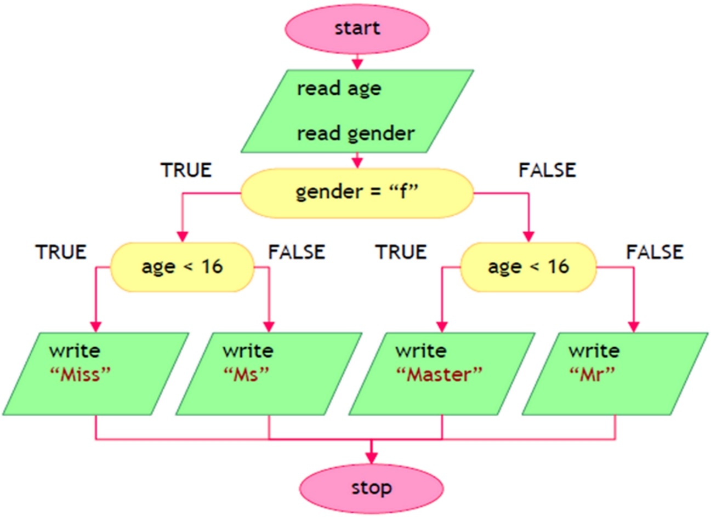

After **reading the input data from the console**, the following **program logic** should be executed:

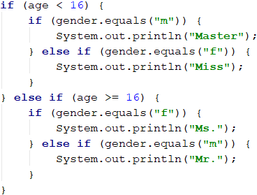

#### Testing in the Judge System

Test your solution here: [https://judge.softuni.org/Contests/Practice/Index/653#0](https://judge.softuni.org/Contests/Practice/Index/653#0).


### Example: Small Shop

A Bulgarian entrepreneur opens **small shops** in **a few cities** with different **prices** for the following **products**:

|product / city|Sofia|Plovdiv|Varna|
|:-------:|:-------:|:-------:|:-------:|
|coffee<br>water<br>beer<br>sweets<br>peanuts|0.50<br>0.80<br>1.20<br>1.45<br>1.60<br>|0.40<br>0.70<br>1.15<br>1.30<br>1.50<br>|0.45<br>0.70<br>1.10<br>1.35<br>1.55|

Calculate the price by the given **city** (string), **product** (string) and **quantity** (double).

#### Sample Input and Output

|Input|Output|Input|Output|
|-------|-------|-------|-------|
|coffee<br>Varna<br>2|0.9|peanuts<br>Plovidv<br>1|1.5|

|Input|Output|Input|Output|
|-------|-------|-------|-------|
|beer<br>Sofia<br>6|7.2|water<br>Plovdiv<br>3|2.1|

#### Solution

We **convert** all of the letters into **lower register** using the function **`.toLowerCase()`**, in order to compare products and cities **no matter** what the letters are – small or capital ones.


#### Testing in the Judge System 

Test your solution here: [https://judge.softuni.org/Contests/Practice/Index/653#1](https://judge.softuni.org/Contests/Practice/Index/653#1).


## More Complex Conditions

Let's take a look at how we can create more complex logical conditions. We can use the logical "**AND**" (**`&&`**), logical "**OR**" (**`||`**), logical **negation** (**`!`**) and **brackets** (**`()`**).

### Logical "AND"

As we saw, in some tasks we have to make **many checks at once**. But what happens when in order to execute some code **more** conditions have to be executed and we **don't want to** make a **negation** (**`else`**) for each one of them? The option with nested **`if` blocks** is valid, but the code would look very **unordered** and for sure – **hard** to read and maintain.  

The logical "**AND**" (operator **`&&`**) means a few conditions have to be **fulfilled simultaneously**. The following table of truthfulness is applicable:

|a|b|a && b|
|-----|-----|-----|
|true<br>true<br>false<br>false|true<br>false<br>true<br>false|true<br>false<br>false<br>false|

### How does the && Operator work?

The **`&&`** operator accepts **a couple of Boolean** (conditional) statements, which have a **`true`** or **`false`** value, and returns **one** bool statement as a **result**. Using it **instead** of a couple of nested **`if`** blocks, makes the code **more readable**, **ordered** and **easy** to maintain. But how does it **work**, when we put a **few** conditions one after another? As we saw above, the logical **"AND"** returns **`true`**, **only** when it accepts as **arguments statements** with value **`true`**. Respectively, when we have a **sequence** of arguments, the logical "AND" **checks** either until one of the arguments is **over**, or until it **meets** an argument with value **`false`**. 

**Example**:

```java
boolean a = true;
boolean b = true;
boolean c = false;
boolean d = true;
boolean result = a && b && c && d;
// false (as d is not being checked)
```

Програмата ще се изпълни по **следния** начин: **започва** проверката от **`а`**, **прочита** я и отчита, че има стойност **`true`**, след което **проверява** **`b`**. След като е **отчелa**, че **`a`** и **`b`** връщат стойност **`true`**, **проверява следващия** аргумент. Стига до **`c`** и отчита, че променливата има стойност **`false`**. След като програмата отчете, че аргументът **`c`** има стойност **`false`**, тя изчислява израза **до `c`**, **независимо** каква е стойността на **`d`**. За това проверката на **`d`** се **прескача** и целият израз бива изчислен като **`false`**.


### Example: Point in a Rectangle

Checks whether **point {x, y}** is placed **inside the rectangle {x1, y1} – {x2, y2}**. The input data is read from the console and consists of 6 lines: the decimal numbers **x1**, **y1**, **x2**, **y2**, **x** and **y** (as it is guaranteed that **x1 < x2** and **y1 < y2**).

#### Sample Input and Output

|Input |Output |Visualization|
|-----|------|:------:|
|2<br>-3<br>12<br>3<br>8<br>-1|Inside||

#### Solution

A point is internal for a given polygon, if the following four conditions are applied **at the same time**:

* The point is placed to the right from the left side of the rectangle.
* The point is placed to the left from the right side of the rectangle.
* The point is placed downwards from the upper side of the rectangle.
* The point is placed upwards from the down side of the rectangle.


#### Testing in the Judge System

Test your solution here: [https://judge.softuni.org/Contests/Practice/Index/653#2](https://judge.softuni.org/Contests/Practice/Index/653#2).


## Logical "OR"

The logical **"OR"** (operator **`||`**) means that **at least one** among a few conditions is fulfilled. Similar to the operator **`&&`**, the logical **"OR"** accepts a few arguments of **bool** (conditional) type and returns **`true`** or **`false`**. We can easily guess that we **obtain** a value **`true`** every time when at least **one** of the arguments has a **`true`** value. This is shown at the truth table below:

In school, the teacher said: "Ivan or Peter should clean the board". For completing this condition (the board to be clean), it's possible only Ivan to clean it, only Peter to clean it or both of them to do it. 

|a|b|a &#124;&#124; b|
|:-----:|:-----:|:-----:|
|true<br>true<br>false<br>false|true<br>false<br>true<br>false|true<br>true<br>true<br>false|


### How does the || operator work?

We have already learned what the logical **"OR" represents**. But how is it actually being achieved? Just like with the logical **"AND"**, the program **checks** from left to right **the arguments** that are given. In order to obtain **`true`** from the expression, it is necessary for **just one** argument to have a **`true`** value. Respectively, the checking **continues** until an **argument** with **such** value is met or until the arguments **are over**.

Here is one **example** of the **`||`** operator in action:

```java
boolean a = false;
boolean b = true;
boolean c = false;
boolean d = true;
boolean result = a || b || c || d;
// true (as c and d are not being checked)
```

The programs **checks `a`**, accepts that it has a value **`false`** and continues. Reaching **`b`**, it understands that it has a **`true`** value and the whole **expression** is calculated as **`true`**, **without** having to check **`c`** or **`d`**, because their values **wouldn't change** the result of the expression.

### Example: Fruit or Vegetable

Let's check whether a given **product** is **a fruit** or **a vegetable**. The "**fruits**" are: **banana**, **apple**, **kiwi**, **cherry**, **lemon** and **grapes**. The "**vegetables**" are: **tomato**, **cucumber**, **pepper** and **carrot**. Everything else is "**unknown**".

#### Sample Input and Output

|Input|Output|
|----|----|
|banana<br>tomato<br>java|fruit<br>vegetable<br>unknown|

#### Solution

We have to use a few conditional statements with logical "**OR**" (**`||`**):

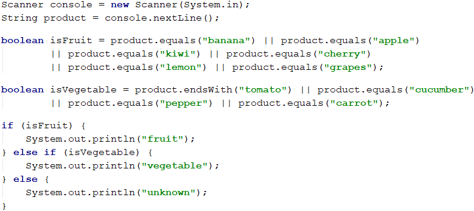

#### Testing in the Judge System

Test your solution here: [https://judge.softuni.org/Contests/Practice/Index/653#3](https://judge.softuni.org/Contests/Practice/Index/653#3).


## Logical Negation

**Logical negation** (operator **`!`**) means that a given condition is **not fulfilled**.

|a|!a|
|:----:|:----:|
|true|false|

The operator **`!`** accepts as an **argument** a bool variable and **returns** its value.

### Example: Invalid Number

A given **number is valid** if it is in the range [**100 … 200**] or it is **0**. Do a validation for an **invalid** number.

#### Sample Input and Output

|Input|Output|
|----|----|
|75|invalid|
|150| (no output)|
|220|invalid|

#### Solution


#### Testing in the Judge System

Test your solution here: [https://judge.softuni.org/Contests/Practice/Index/653#4](https://judge.softuni.org/Contests/Practice/Index/653#4).


## The Parenthesis **`()`** Operator

Like the rest of the operators in programming, the operators **`&&`** and **`||`** have a priority, as in the case **`&&`** is with higher priority than **`||`**. The operator **`()`** serves for **changing the priority of operators** and is being calculated first, just like in mathematics. Using parentheses also gives the code better readability and is considered a good practice. 


## More Complex Conditions - Examples

Sometimes the conditions may be **very complex**, so they can require a long bool expression or a sequence of conditions. Let's take a look at a few examples.

### Example: Point on a Rectangle Border

Write a program that checks whether a **point {x, y}** is placed **onto any of the sides of a rectangle {x1, y1} – {x2, y2}**. The input data is read from the console and consists of 6 lines: the decimal numbers **x1**, **y1**, **x2**, **y2**, **x** and **y** (as it is guaranteed that **x1 < x2** and **y1 < y2**). Print "**Border**" (if the point lies on any of the sides) or "**Inside / Outside**" (in the opposite case).

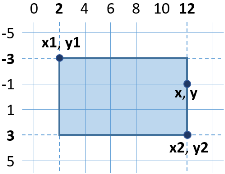

#### Sample Input and Output

|Input|Output|Input|Output|
|-----|-----|-----|-----|
|2<br>-3<br>12<br>3<br>12<br>-1|Border|2<br>-3<br>12<br>3<br>8<br>-1|Inside / Outside|

#### Solution

The point lies on any of the sides of the rectangle if:
* **x** coincides with **x1** or **x2** and at the same time **y** is between **y1** and **y2** or
* **y** coincides with **y1** or **y2** and at the same time **x** is between **x1** and **x2**.


#### Testing in the Judge System

Test your solution here: [https://judge.softuni.org/Contests/Practice/Index/653#5](https://judge.softuni.org/Contests/Practice/Index/653#5).


### Example: Fruit Shop

A fruit shop during **week days** sells in the following **prices**:

|Fruit|Price|
|:-----:|:-----:|
|banana<br>apple<br>orange<br>grapefruit<br>kiwi<br>pineapple<br>grapes|2.50<br>1.20<br>0.85<br>1.45<br>2.70<br>5.50<br>3.85|

During the **weekend days** the prices are **higher**:

|Fruit|Price|
|:-----:|:-----:|
|banana<br>apple<br>orange<br>grapefruit<br>kiwi<br>pineapple<br>grapes|2.70<br>1.25<br>0.90<br>1.60<br>3.00<br>5.60<br>4.20|

Write a program that **reads** from the console a **fruit** (banana / apple / …), **a day of the week** (Monday / Tuesday / …) and **a quantity (a decimal number)** and **calculates the price** according to the prices from the tables above. The result has to be printed **rounded up to 2 digits after the decimal point**. Print **“error”** if it is an **invalid day** of the week or an **invalid name** of a fruit.

#### Sample Input and Output

|Input|Output|Input|Output|
|----|----|----|----|
|orange<br>Sunday<br>3|2.70|kiwi<br>Monday<br>2.5|6.75|

|Input|Output|Input|Output|
|----|----|----|----|
|grapes<br>Saturday<br>0.5|2.10|tomato<br>Monday<br>0.5|error|

#### Solution

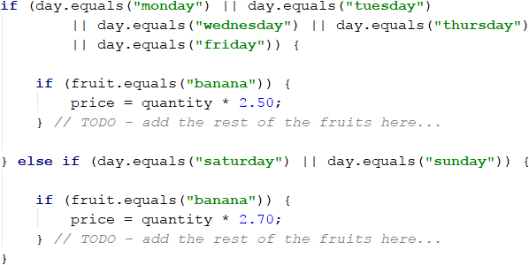

#### Testing in the Judge System

Test your solution here: [https://judge.softuni.org/Contests/Practice/Index/653#6](https://judge.softuni.org/Contests/Practice/Index/653#6).


### Example: Trade Fees

A company is giving the following **commissions** to its traders according to the **city**, in which they are working and the **volume of sales s**:

|City|0 <= s <= 500|500 < s <= 1000|1000 < s <= 10000|s > 10000|
|:----:|:----:|:----:|:----:|:----:|
|Sofia<br>Varna<br>Plovdiv|5%<br>4.5%<br>5.5%|7%<br>7.5%<br>8%|8%<br>10%<br>12%|12%<br>13%<br>14.5%|

Write a **program** that reads the name of a **city** (string) and the volume of **sales** (double) and calculates the rate of the commission fee. The result has to be shown rounded **up to 2 digits after the decimal point**. When there is an **invalid city or volume of sales** (a negative number), print "**error**".

#### Sample Input and Output

|Input|Output|Input|Output|Input|Output|
|-----|-----|-----|-----|-----|-----|
|Sofia<br>1500|120.00|Plovidv<br>499.99|27.50|Kaspichan<br>-50|error|

#### Solution

When reading the input, we could convert the city into small letters (with the function **`.toLowerCase()`**). Initially we set the commission fee to **`-1`**. It will be changed if the city and the price range are found in the table of commissions.
To calculate the commission according to the city and volume of sales, we need a few nested **`if` statements**, as in the sample code below:

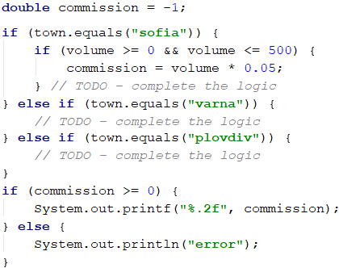

#### Testing in the Judge System

Test your solution here: [https://judge.softuni.org/Contests/Practice/Index/653#7](https://judge.softuni.org/Contests/Practice/Index/653#7).

<table><tr><td></td><td><b>It is a good practice</b> to use <b>blocks</b> that are <b>enclosed</b> with curly braces <b><code>{ }</code></b> after <b><code>if</code></b> and <b><code>else</code></b>. Also, it is recommended during writing to <b>move aside</b> the code <b>after <code>if</code> and <code>else</code></b> with a single tabulation <b>inward</b>, in order to make the code more easily readable.</td>
</tr></table>

## Условна конструкция switch-case

Конструкцията **`switch-case`** работи като поредица от **`if-else`** блокове. Когато работата на програмата ни зависи от стойността на **една променлива**, вместо да правим последователни проверки с **`if-else`** блокове, можем да **използваме** условната конструкция **`switch`**. Тя се използва за **избор измежду списък с възможности**. Конструкцията сравнява дадена стойност с определени константи и в зависимост от резултата предприема действие.

**Променливата**, която искаме да **сравняваме**, поставяме в **скобите след оператора `switch`** и се нарича "**селектор**". Тук **типът трябва да е сравним** (числа, стрингове). **Последователно** започва **сравняването** с всяка една **стойност**, която **се намира** след **`case` етикетите**.
При **съвпадение** започва изпълнението на кода от съответното място и продължава, докато стигне оператора **`break`**. В някои програмни езици (като C# например) наличието на **`break`** е **задължително** за **всеки `case`**, който съдържа изпълнение на програмна логика. В **Java** операторът **`break`** може да се изпуска, за да се изпълнява код от друга **`case`** конструкция, докато не се стигне до следващия **`break`** оператор. Макар и позволено от езика **Java**, изпускането на оператор **`break`** след етикет **`case`** се налага изключително рядко и не е добра практика, тъй като води до така нареченото **пропадане** на програмния код. 
При **липса** на **съвпадение**, се изпълнява **`default`** конструкцията, **ако** такава **съществува**.

```java
switch (селектор) {

    case стойност1:
        конструкция;
        break;
    case стойност2:
        конструкция;
        break;
    case стойност3:
        конструкция;
        break;
    …
    default:
        конструкция;
        break;
}
```

### Пример: ден от седмицата

Нека напишем програма, която принтира **деня от седмицата** (на английски) според **въведеното число** (1 … 7) или "**Error!**", ако е подаден невалиден ден.

#### Примерен вход и изход

|Вход|Изход|
|-----|-----|
|1<br>7<br>-1|Monday<br>Sunday<br>Error!|

#### Решение

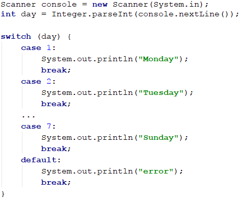

<table><tr><td></td>
<td><b>Добра практика</b> е на <b>първо</b> място да поставяме онези <b><code>case</code> случаи</b>, които обработват <b>най-често случилите се ситуации</b>, а <b><code>case</code> конструкциите</b>, обработващи <b>по-рядко възникващи ситуации</b>, да оставим в <b>края преди <code>default</code> конструкцията</b>. Друга <b>добра практика</b> е да <b>подреждаме <code>case</code> етикетите</b> в <b>нарастващ ред</b>, без значение дали са целочислени или символни.</td>
</tr></table>

#### Тестване на решението

Тествайте решението си тук: [https://judge.softuni.org/Contests/Practice/Index/653#8](https://judge.softuni.org/Contests/Practice/Index/653#8).


### Множество етикети в switch-case

В **Java** имаме възможността да **използваме множество `case`** етикети, когато те трябва да изпълняват **един и същи** код. При този начин на записване, когато **програмата** ни намери **съвпадение**, ще изпълни **следващия** срещнат код, тъй като **след** съответния **`case`** етикет **липсва код** за изпълнение и **`break`** оператор.

```java
switch (селектор) {

    case стойност1:
    case стойност2:
    case стойност3:
        конструкция;
        break;
    case стойност4:
    case стойност5:
        конструкция;
        break;
    …
    default:
        конструкция;
        break;
}
```

### Пример: вид животно

Напишете програма, която принтира вида на животно според името му: 

* dog -> **mammal**
* crocodile, tortoise, snake -> **reptile**
* others -> **unknown**

#### Примерен вход и изход

|Вход|Изход|Вход|Изход|Вход|Изход|
|-----|-----|-----|-----|-----|-----|
|tortoise|reptile|dog|mammal|elephant|unknown|

#### Решение

Можем да решим задачата чрез **`switch`**-**`case`** проверки с множество етикети по следния начин:

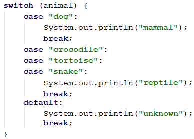

#### Тестване на решението

Тествайте решението си тук: [https://judge.softuni.org/Contests/Practice/Index/653#9](https://judge.softuni.org/Contests/Practice/Index/653#9).


## Какво научихме от тази глава?

В настоящата глава научихме как можем да използваме **по-сложни условия и проверки**, логически оператори в условията и **вложени `if`-конструкции**.

### Вложени проверки

```java
if (условие1) {
    if (условие2) {	
        // тяло;		
    } else {	
        // тяло;
    }
}
```

### По-сложни проверки с &&, ||, ! и ()

```java
if ((x == left || x == right) && y <= top && y >= bottom)
    System.out.println (…); 
```

#### Switch-case проверки

```java
switch (селектор) {
    case стойност1:
        конструкция;
        break;
    case стойност2:
    case стойност3:
        конструкция;
        break;
    …
    default:
        конструкция;
        break;
}
```


## Упражнения: по-сложни проверки

Нека сега да упражним работата с по-сложни проверки. Да решим няколко практически задачи.

### Задача: кино

В една кинозала столовете са наредени в **правоъгълна** форма в **r** реда и **c** колони. Има три вида прожекции с билети на **различни** цени:

* **Premiere** – премиерна прожекция, на цена **12.00** лева.
* **Normal** – стандартна прожекция, на цена **7.50** лева.
* **Discount** – прожекция за деца, ученици и студенти на намалена цена от **5.00** лева.

Напишете програма, която въвежда **тип прожекция** (стринг), брой **редове** и брой **колони** в залата (цели числа) и изчислява **общите приходи** от билети при **пълна зала**. Резултатът да се отпечата във формат като в примерите по-долу - с 2 цифри след десетичния знак.

#### Примерен вход и изход

|Вход|Изход|Вход|Изход|
|----|-----|----|-----|
|Premiere<br>10<br>12|1440.00 leva|Normal<br>21<br>13|2047.50 leva|

#### Насоки и подсказки 

При прочитането на входа можем да обърнем типа на прожекцията в малки букви (с функцията **`.toLowerCase()`**). Създаваме и инициализираме променлива, която ще ни съхранява изчислените приходи. В друга променлива пресмятаме пълния капацитет на залата. Използваме **`switch-case`** условна конструкция, за да изчислим прихода в зависимост от вида на прожекцията и отпечатваме резултата на конзолата в зададения формат (потърсете нужната **Java** функционалност в интернет). 

Примерен код (части от кода са замъглени с цел да се стимулира самостоятелно мислене и решение):

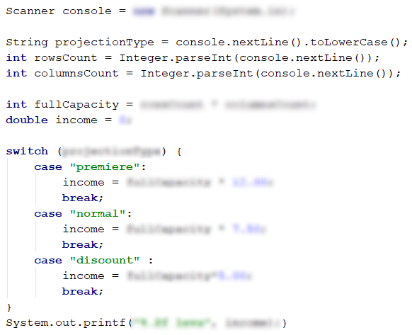

#### Тестване на решението

Тествайте решението си тук: [https://judge.softuni.org/Contests/Practice/Index/653#10](https://judge.softuni.org/Contests/Practice/Index/653#10).


### Задача: волейбол

Влади е студент, живее в София и си ходи от време на време до родния град. Той е много запален по волейбола, но е зает през работните дни и играе **волейбол** само през **уикендите** и в **празничните дни**. Влади играе **в София** всяка **събота**, когато **не е на работа** и **не си пътува до родния град**, както и в **2/3 от празничните дни**. Той пътува до **родния си град h пъти** в годината, където играе волейбол със старите си приятели в **неделя**. Влади **не е на работа 3/4 от уикендите**, в които е в София. Отделно, през **високосните години** Влади играе с **15% повече** волейбол от нормалното. Приемаме, че годината има точно **48 уикенда**, подходящи за волейбол. 
Напишете програма, която изчислява **колко пъти Влади е играл волейбол** през годината. **Закръглете резултата** надолу до най-близкото цяло число (напр. 2.15 -> 2; 9.95 -> 9).

Входните данни се четат от конзолата:

* Първият ред съдържа думата "**leap**" (високосна година) или "**normal**" (нормална година с 365 дни).
* Вторият ред съдържа цялото число **p** – брой празници в годината (които не са събота или неделя).
* Третият ред съдържа цялото число **h** – брой уикенди, в които Влади си пътува до родния град.

#### Примерен вход и изход

|Вход|Изход|Вход|Изход|
|-----|-----|-----|-----|
|leap<br>5<br>2|45|normal<br>3<br>2|38|

|Вход|Изход|Вход|Изход|
|-----|-----|-----|-----|
|normal<br>11<br>6|44|leap<br>0<br>1|41|

#### Насоки и подсказки

Стандартно прочитаме входните данни от конзолата като за избягване на грешки при въвеждане обръщаме текста в малки букви с функцията **`.toLowerCase()`**. Последователно пресмятаме **уикендите прекарани в София**, **времето за игра в София** и **общото време за игра**. Накрая проверяваме дали годината е **високосна**, правим допълнителни изчисления при необходимост и извеждаме резултата на конзолата **закръглен надолу** до най-близкото **цяло число** (потърсете **Java** клас с такава функционалност в интернет).

Примерен код (части от кода са замъглени с цел да се стимулира самостоятелно мислене и решение):

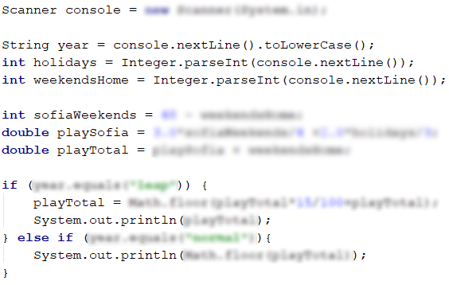

#### Тестване на решението

Тествайте решението си тук: [https://judge.softuni.org/Contests/Practice/Index/653#11](https://judge.softuni.org/Contests/Practice/Index/653#11).


### Задача: * точка във фигурата

Фигура се състои от **6 блокчета с размер h \* h**, разположени като на фигурата. Долният ляв ъгъл на сградата е на позиция {0, 0}. Горният десен ъгъл на фигурата е на позиция {**2\*h**, **4\*h**}. На фигурата координатите са дадени при **h = 2**:

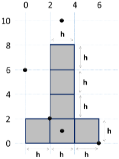

Да се напише програма, която въвежда цяло число **h** и координатите на дадена **точка {x, y}** (цели числа) и отпечатва дали точката е вътре във фигурата (**inside**), вън от фигурата (**outside**) или на някоя от стените на фигурата (**border**).

#### Примерен вход и изход

|Вход|Изход|Вход|Изход|
|-----|-----|-----|-----|
|2<br>3<br>10|outside|2<br>3<br>1|inside|

|Вход|Изход|Вход|Изход|
|-----|-----|-----|-----|
|2<br>2<br>2|border|2<br>6<br>0|border|

|Вход|Изход|Вход|Изход|
|----|-----|-----|-----|
|2<br>0<br>6|outside|15<br>13<br>55|outside|

|Вход|Изход|Вход|Изход|
|-----|-----|-----|-----|
|15<br>29<br>37|inside|15<br>37<br>18|outside|

|Вход|Изход|Вход|Изход|
|-----|-----|-----|-----|
|15<br>-4<br>7|outside|15<br>30<br>0|border|

#### Насоки и подсказки

Примерна логика за решаване на задачата (не е единствената правилна):

* Може да разделим фигурата на **два правоъгълника** с обща стена:

<p align="center"></p>

* Една точка е **външна (outside)** за фигурата, когато е едновременно **извън** двата правоъгълника.
* Една точка е **вътрешна (inside)** за фигурата, ако е вътре в някой от правоъгълниците (изключвайки стените им) или лежи върху общата им стена.
* В **противен случай** точката лежи на стената на правоъгълника (**border**).

Примерен код (части от кода са замъглени с цел да се стимулира самостоятелно мислене и решение):

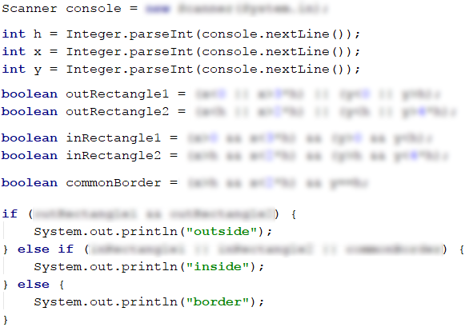

#### Тестване на решението

Тествайте решението си тук: [https://judge.softuni.org/Contests/Practice/Index/653#12](https://judge.softuni.org/Contests/Practice/Index/653#12).
