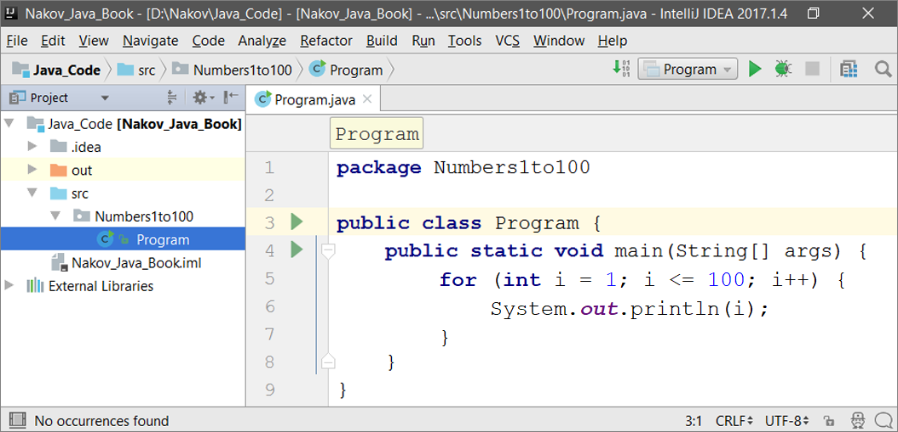
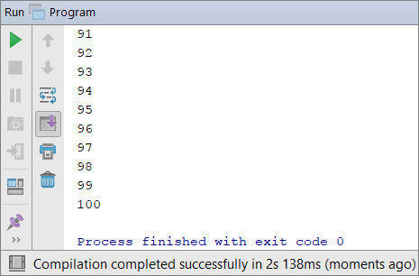
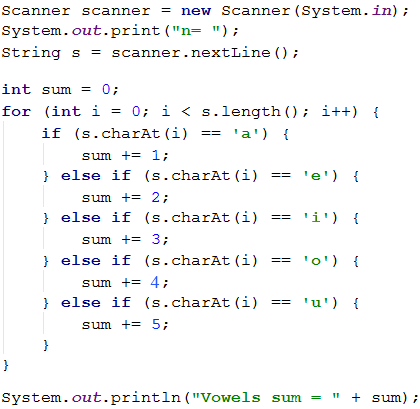
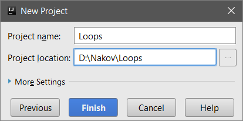
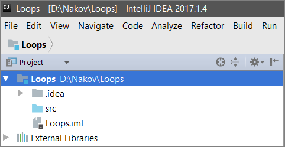
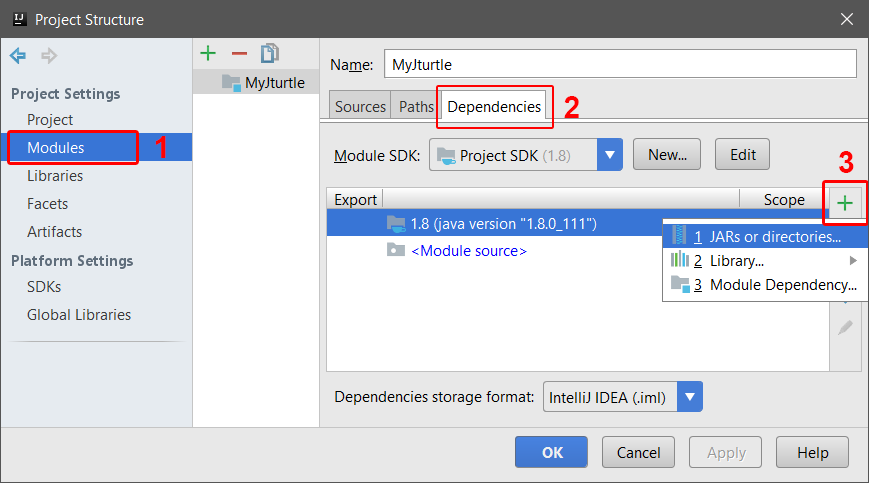
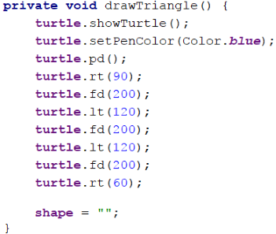
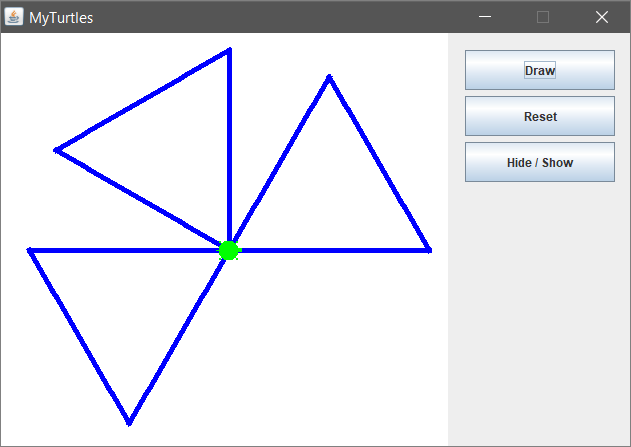

# Chapter 5.1. Repetitions (Loops)

In the present chapter, we will get familiar with how to **repeat blocks of commands**, known in software development as "**loops**". We will write several loops using the **`for`** operator in its simplest form. Finally, we will solve some practical problems that require repeating a series of actions, using loops.

## Video

  Watch the video lesson on this chapter here: <a target="_blank"
  href="https://www.youtube.com/watch?v=VyoaWLnbDi0">
  https://www.youtube.com/watch?v=VyoaWLnbDi0</a>.

## Repetitions of blocks of code (for loop)

Often in programming, we have to  **execute a block of code multiple times**. To do that, we use the so-called **loops**. Let us look at an example of a **`for` loop** that passes sequentially through the numbers from 1 to 10 and prints them: 

The loop starts with the **operator `for`** and passes through all values for a particular variable in a given range, for example, the numbers from 1 to 10 (included), and for each value, it performs a series of commands.

When declaring the loop, an **initial value** and an **end value** are specified. **The body of the loop** is enclosed in curly brackets **`{ }`** and represents a block of one or multiple commands. The figure below shows the structure of a **`for` loop**:

In most cases, a **`for` loop** is run from **`1`** to **`n`** times(for example from 1 to 10). The purpose of the loop is to pass sequentially through the numbers 1, 2, 3, …, n, and for each number to perform a particular action. In the example above, the **`i`** variable takes values from 1 to 10, and the current value is printed in the body of the loop. The loop repeats 10 times, and each of these repetitions is called an "**iteration**".

### Problem: Numbers from 1 to 100

Write a program that **prints the numbers from 1 to 100**. The program does not accept input and prints the numbers from 1 to 100 sequentially, each on a separate line. 

#### Hints and Guidelines

We can solve the problem using a **`for` loop**, which will assign values from 1 to 100 to the variable **`i`** and print the numbers in the body of the loop:

**Start** the program with [**Shift+F10**] and **test it**:

#### Testing in The Judge System

Test your solution here: [https://judge.softuni.org/Contests/Practice/Index/655#0](https://judge.softuni.org/Contests/Practice/Index/655#0).

You should get **100 points** (fully accurate solution).

## Code Snippet for The **`for`** Loop in IntelliJ IDEA

In software development, we regularly need to write loops dozens of times a day. That is why in most integrated development environments (IDE), there are **code snippets** for writing loops. One such example is the **snippet for the `for` loop in IntelliJ IDEA**. Write down **`fori`** in the Java code editor in IntelliJ IDEA and **press** [**Enter**]. IntelliJ IDEA will run the snippet, and you will see the entire **`for` loop** written down. All you have to do now is to add the values. 

**Try it yourself** to master using the code snippet for the **`for` loop** in IntelliJ IDEA.

### Problem: Numbers Ending in 7

Write a program that finds all numbers within the range [**1 … 1000**] that ends with 7. 

#### Hints and Guidelines

We can solve the problem by combining a **`for` loop**, which will go through the numbers from 1 to 1000, and a **condition** to check if they end with 7. There are other solutions too, but let's solve the problem using a **loop + condition**:

#### Testing in The Judge System

Test your solution here: [https://judge.softuni.org/Contests/Practice/Index/655#1](https://judge.softuni.org/Contests/Practice/Index/655#1).

### Problem: Latin Letters

Write a program that prints the letters from the Latin alphabet: **a, b, c, …, z**.

#### Hints and Guidelines

It is good to know that the **`for` loops** don't work only with numbers. We can solve the problem by running a **`for` loop** that passes sequentially through all letters in the Latin alphabet:

#### Testing in The Judge System

Test your solution here: [https://judge.softuni.org/Contests/Practice/Index/655#2](https://judge.softuni.org/Contests/Practice/Index/655#2).

### Problem: Sum Numbers 

Write a program that **reads `n` integers from the console and calculates the sum**.

* The first line of the input is an integer **`n`** denoting the number of integers that will be summed.
* The following **`n`** lines consist of one integer.
* Calculate the sum and print the result.

#### Sample Input and Output

| Input | Output |
| --- | --- |
| 2 10 20 | 30 |
| 3 -10 -20 -30 | -60 |
| 4 45 -20 7 11  | 43 |
| 1 999 | 999 | 
| 0 | 0 |

#### Hints and Guidelines

We can solve the problem by calculating the sum of numbers the following way:
 - We read the input number **`n`**.
 - Initially, we start with **`sum = 0`**.
 - We run a loop from 1 to **`n`**, and on each iteration, we read the input number **`num`** and add it to the **`sum`**.
 - Finally, we print the calculated result **`sum`**.
 
Below you can find the source code for the solution:

#### Testing in The Judge System

Test your solution here: [https://judge.softuni.org/Contests/Practice/Index/655#3](https://judge.softuni.org/Contests/Practice/Index/655#3).

### Problem: Max Number

Write a program that inputs **n integers** (**n** > 0) and finds the **Max Number** (the largest number) among them. The first line of the input specifies the number of integers **n**. The following **`n`** lines consist of one integer. Examples:

#### Sample Input and Output

| Input | Output |
| --- | --- |
| 2 100 99 | 100 | 
| 3 -10 20 -30 | 20 |
| 4 45 -20 7 99  | 99 | 
| 1 999 | 999 |
| 2 -1 -2 | -1 |

#### Hints and Guidelines

We enter the first number **`n`** (the number of integers to be entered). We assign the current maximum **`max`** an initial neutral value, for example **-100000** (or **`Integer.MIN_VALUE`**). Using a **`for` loop** which iterates **n-1 times**, we read one integer **`num`** on each iteration. If the read number **`num`** is higher than the current maximum **`max`**, we assign the value of **`num`** to the variable **`max`**. Finally, **`max`** will contain the highest number, and we print it on the console.

#### Testing in The Judge System

Test your solution here: [https://judge.softuni.org/Contests/Practice/Index/655#4](https://judge.softuni.org/Contests/Practice/Index/655#4).

### Problem: Min Number

Write a program that inputs **n integers** (**n** > 0) and finds **the Min Number** among them.  The first line of the input specifies the number of integers **n**. The following **`n`** lines consist of one integer. Examples: 

#### Sample Input and Output

| Input | Output | 
| --- | --- |
| 2 100 99 | 99 |
| 3 -10 20 -30 | -30 |
| 4 45 -20 7 99  | -20 |

#### Hints and Guidelines

The problem is identical to the previous one, but this time we will start with another neutral starting value **10000000000000** (or **`Integer.MAX_VALUE`**).

#### Testing in The Judge System

Test your solution here: [https://judge.softuni.org/Contests/Practice/Index/655#5](https://judge.softuni.org/Contests/Practice/Index/655#5).

### Problem: Left and Right Sum

Write a program that inputs **2 \* n integers** and checks if the **sum of the first n numbers** (left sum) is equal to the **sum of the second n numbers** (right sum). If the sums are equal, print **"Yes" + sum**, if not, print **"No" + difference**. Calculate the difference as a positive number (absolute value). The format of the output must be identical to the examples below.

#### Sample Input and Output

| Input | Output | Input | Output |
| --- | --- | --- | --- | 
| 2 10 90 60 40 | Yes, sum = 100 | 2 90 9 50 50 | No, diff = 1 |

#### Hints and Guidelines

Input the number **n**, after that the first **n** numbers (**left** half) and sum them up. Input the second **n** numbers (**right** half) and find their sum. We calculate the **difference**  between the sums by absolute value: **`Math.abs(leftSum - rightSum)`**. If the difference is **0**, print **"Yes" + sum**, otherwise print **"No" + difference**.

#### Testing in The Judge System

Test your solution here: [https://judge.softuni.org/Contests/Practice/Index/655#6](https://judge.softuni.org/Contests/Practice/Index/655#6).

### Problem: Odd Even Sum 

Write a program that inputs **n integers** and checks if **the sum of numbers on even positions** is equal to **the sum of numbers on odd positions**. If the sums are equal, print **"Yes" + sum**, otherwise print **"No" + difference**. Calculate the difference as a positive number (absolute value). The format of the output must be identical to the examples below.

#### Sample Input and Output

| Input | Output |
| --- | --- |
| 4 10 50 60 20 | Yes Sum = 70 |
| 4 3 5 1 -2 | No Diff = 1 |
| 3 5 8 1 | No Diff = 2 |

#### Hints and Guidelines

We input the numbers one by one and calculate the two **sums** (the numbers on **even** positions and the numbers on **odd** positions). Identically to the previous problem, we calculate the absolute value of the difference and print the result (**"Yes" + sum** if the difference equals 0 or **"No" + difference** in every other case).

**`+=`** is a **combined assignment operator** that is used frequently. It adds the value of the right to the left operand and then assigns the result to the left operand. 
**C += A** is equivalent to **C = C + A**.

#### Testing in The Judge System

Test your solution here: [https://judge.softuni.org/Contests/Practice/Index/655#7](https://judge.softuni.org/Contests/Practice/Index/655#7).

### Problem: Vowels Sum 

Write a program that inputs **text** (string), calculates and prints **the sum of the values of vowels** according to the table below:

| a | e | i | o | u | 
| :---: | :---: | :---: | :---: | :---: |
| 1 | 2 | 3 | 4 | 5 |

#### Sample Input and Output

| Input | Output | Input | Output | 
| --- | --- | --- | --- |
| hello | 6 (e+o = 2+4 = 6) | bamboo | 9 (a+o+o = 1+4+4 = 9) |
| hi | 3 (i = 3) | beer | 4 (e+e = 2+2 = 4) |

#### Hints and Guidelines

We read the input text **`s`**, after that, we null the sum and run a loop from **0** to **`s.length() - 1`** (text length -1). We check every letter **`s.charAt(i)`** if it is a vowel and add its value to the sum. 

#### Testing in The Judge System

Test your solution here: [https://judge.softuni.org/Contests/Practice/Index/655#8](https://judge.softuni.org/Contests/Practice/Index/655#8).

## What Have We Learned from This Chapter?

We can repeat a block of code using **`for` loop**:

We can read a series of **`n`** numbers from the console:

## Problems: Loops

After we had acquainted with the loops, it is time to **solidify what we have learned by practicing it**, by writing a lot of code. Let us solve some problems for exercise.

### Creating a new project in IntelliJ IDEA

We start by creating a new project in IntelliJ IDEA to better organize our solutions for the exercise. For each problem, we will create a separate class.

Start IntelliJ IDEA and select: **[Create New Project]**.

After that, on the left side  of the window, select Java. If the **PROJECT SDK:** field is empty, choose the path to the Java **JDK** installation directory and click on the button **[Next]**.

In the next window, we again click on the button **[Next]**.

We name the project (Project name:) **Loops** and select the directory where the project will be saved (Project location:). After that, we click on the button **[Finish]**.

 
In the next window, we click on the **[OK]** button to create a **Project location** if the directory doesn't exist.

We created a new project. If we click on the triangle in front of **Loops** on the left side of the window, the structure of the project itself will open.

To create a **Package** in our project, which contains all the classes with the solutions from the exercise, right-click with the mouse on **src**, then select **New** -> **Package** and name it **problems** (with a small first letter).

To create a new class for the first problem, right-click with the mouse on **problems**, select **New** -> **Java Class**, and name it **problem_01** (with a capital letter).

After these changes, the structure of the project should look like this:
 

 
For each subsequent exercise, we will create a new class in the way described above. 
 
### Problem: Half Sum Element

Write a program that inputs **n integers** and checks if there is a number among them that is equal to the sum of all others. If there is such an element, print **"Yes" + its value**. Otherwise, print **"No" + the difference between the largest element and the sum of the rest**, as an absolute value. 

#### Sample Input and Output

| Input | Output | Comments |
| --- | --- | :---: |
| 7 3 4 1 1 2 12 1 | Yes Sum = 12 | 3 + 4 + 1 + 2 + 1 + 1 = 12 |
| 4 6 1 2 3 | Yes Sum = 6 | 1 + 2 + 3 = 6 |
| 3 1 1 10 | No Diff = 8 | &#124;10 - (1 + 1)&#124; = 8 |
| 3 5 5 1 | No Diff = 1 | &#124;5 - (5 + 1)&#124; = 1 |
| 3 1 1 1 | No Diff = 1 | - |

#### Hints and Guidelines

We must calculate the **sum** of all elements, find the **largest** of them and check the condition.

#### Testing in The Judge System

Test your solution here: [https://judge.softuni.org/Contests/Practice/Index/655#9](https://judge.softuni.org/Contests/Practice/Index/655#9).

### Problem: Odd \/ Even position 

Write a program that reads **n numbers** and calculates **the sum**, the **min**, and **max** values of the numbers on **even** and **odd** positions (counted from 1). If there is no min / max element, print **"No"**. 

#### Sample Input and Output

| Input | Output | Input | Output |
| --- | --- | --- | --- |
| 6 2 3 5 4 2 1 | OddSum=9, OddMin=2, OddMax=5, EvenSum=8, EvenMin=1, EvenMax=4 | 2 1.5 -2.5 | OddSum=1.5, OddMin=1.5, OddMax=1.5, EvenSum=-2.5, EvenMin=-2.5, EvenMax=-2.5 |
| 1 1 | OddSum=1, OddMin=1, OddMax=1, EvenSum=0, EvenMin=No, EvenMax=No | 0 | OddSum=0, OddMin=No, OddMax=No, EvenSum=0, EvenMin=No, EvenMax=No |
| 5 3 -2 8 11 -3 | OddSum=8, OddMin=-3, OddMax=8, EvenSum=9, EvenMin=-2, EvenMax=11 | 4 1.5 1.75 1.5 1.75 | OddSum=3, OddMin=1.5, OddMax=1.5, EvenSum=3.5, EvenMin=1.75, EvenMax=1.75 |
| 1 -5 | OddSum=-5, OddMin=-5, OddMax=-5, EvenSum=0, EvenMin=No, EvenMax=No | 3 -1 -2 -3 | OddSum=-4, OddMin=-3, OddMax=-1, EvenSum=-2, EvenMin=-2, EvenMax=-2 |

#### Hints and Guidelines

The problem combines several previous problems: finding the **min**, **max**, and the **sum**, as well as processing elements on **even and odd positions**. Check your solutions to the previous problems again.

In the current problem, it is better to work with **fractions** (not integers). The sum, the min, and the max value will also be fractions. We have to use a **neutral starting value** in finding the min / max value, for example **10000.0** and **-10000.0**. If the result is equal to the neutral value, we will print **“No”**.

#### Testing in The Judge System

Test your solution here: [https://judge.softuni.org/Contests/Practice/Index/655#10](https://judge.softuni.org/Contests/Practice/Index/655#10).

### Problem: Equal Pairs 

There are **2 \* n numbers**. The first and the second form a **pair**, the third and the fourth number also, and so on. Each pair has a **value** – the sum of its numbers. Write a program that checks **if all pairs have equal values**.

If the value is the same, print **"Yes, value=…" + the value** otherwise, print the  **maximum difference** between two consecutive pairs in the following format - **"No, maxdiff=…" + the maximum difference**. 

The input consists of number **n**, followed by **2\*n integers**, one per line.

#### Sample Input and Output

| Input | Output | Comments |
| --- | --- | :---: | 
| 3 1 2 0 3 4 -1| Yes, value=3 | values = {3, 3, 3} equal values | 
| 2 1 2 2 2 | No, maxdiff=1 | values = {3, 4} differences = {1} max difference = 1 |
| 4 1 1 3 1 2 2 0 0 | No, maxdiff=4 | values = {2, 4, 4, 0} differences = {2, 0, 4} max difference = 4 |
| 1 5 5 | Yes, value=10 | values = {10} one value equal values |
| 2 -1 0 0 -1 | Yes, value=-1 | values = {-1, -1} equal values | 
| 2 -1 2 0 -1 | No, maxdiff=2 | values = {1, -1} differences = {2} max difference = 2 |

#### Hints and Guidelines

We read the input numbers **in pairs**. For each pair, we calculate the **sum**. While reading the input pairs, for each pair, except the first one, we have to calculate **the difference with the previous one**. To do that, we need to store the sum of the previous pair in a separate variable. Finally, we find the **largest difference** between the two pairs. If it is **0**, print **“Yes”** + the value, otherwise - **“No”** + the difference.

#### Testing in The Judge System

Test your solution here: [https://judge.softuni.org/Contests/Practice/Index/655#11](https://judge.softuni.org/Contests/Practice/Index/655#11).

## Problem: Graphical and Web Applications

In the current chapter, we learned about **loops** as construction in programming that allows us to repeat a given action or a group of actions many times. Now let us play with them. To do that, we will draw some figures that will consist of many repeating graphical elements. This time, we will not do it in the console but in a graphical environment using "**turtle graphics**". It will be interesting. And it is not at all complicated. Try it!

### Problem: Turtle Graphics GUI Application

The purpose of the following exercise is to play with a **drawing library**, also known as **“turtle graphics”**. We will build a graphical application (GUI App) in which we will: **draw different figures**, moving our **“turtle”** across the screen via operations like "move 100 positions forward", "turn 30 degrees to the right", "move 50 more positions forward". The application will look approximately like this:

Let us get familiar with **the concept of drawing "Turtle Graphics"**. Take a look at the following sources:
  * Definition of “turtle graphics”: [https://wiki.c2.com/?TurtleGraphics](https://wiki.c2.com/?TurtleGraphics)
  * Article on "turtle graphics" in Wikipedia – [https://en.wikipedia.org/wiki/Turtle_graphics](https://en.wikipedia.org/wiki/Turtle_graphics)
  * Interactive online tool for drawing with a turtle – [https://blockly-games.appspot.com/turtle](https://blockly-games.appspot.com/turtle)

We will start by creating a new **Java project** in **IntelliJ IDEA**. Add a new package **`app`** (earlier in this chapter we described how to do it). Download **`MyTurtle.java`** and **`jturtle-0.1.1.jar`** from [https://github.com/SoftUni/Programming-Basics-Book-Java-EN/tree/master/assets/chapter-5-1-assets](https://github.com/SoftUni/Programming-Basics-Book-Java-EN/tree/master/assets/chapter-5-1-assets). **`MyTurtle.java`** is a pre-written class, which will help us get acquainted faster with the library **`jturtle-0.1.1.jar`**, which runs **the turtle**. Using file explore, we copy **`MyTurtle.java`** into the directory **`app`** of the project. Then we need to add the external library **`jturtle-0.1.1.jar`** in our project. This is done as follows:
  * Select **Project Structure** from the **File** menu (CTRL + SHIFT + ALT + S).
  * Click on **Select Modules** in the left pane.
  * Click on the **Dependencies** tab.
  * Click **'+'** → **JARs or directories**.

In the next window select the path to **jturtle-0.1.1.jar** and click [**OK**].
 

In the next window, mark the box **classes** and click [**OK**].
 

In the next window, click [**OK**], and we are ready to open **`MyTurtle.java`**.
  

#### Main Methods in `Turtle` Class

These are the main actions in `Turtle` class with which we draw:

| Return   value | Method and its description |
| ------ | ---------------------------------------- |
| Turtle | **back**(double distance) – moves the turtle back | 
| Turtle | **bk**(double distance) – works as **back**(double distance) |
| Turtle | **forward**(double distance) – moves the turtle forward |
| Turtle | **fd**(double distance) – works as **forward**(double distance) |
| Turtle | **hideTurtle**() – hides the turtle |
| Turtle | **ht**() – works as **hideTurtle**() |
| Turtle | **home**() – moves the turtle back to its original position pointing north |
| Turtle | **left**(double degrees) – rotates the turtle to the left(in degrees) |
| Turtle | **lt**(double degrees) – works as **left**(double degrees) |
| Turtle | **penDown**() – attaches a pen to the turtle, which leaves a line when the turtle moves |
| Turtle | **pd**() – works as **penDown**() |
| Turtle | **penUp**() – detaches the pen from the turtle |
| Turtle | **penWidth**(int newWidth) – sets the width of the pen |
| Turtle | **right**(double degrees) – rotates the turtle to the right(in degrees) |
| Turtle | **rt**(double degrees) – works as **right**(double degrees) |
| Turtle | **setColor**(Color color) – sets the color of the pen |
| Turtle | **setLineWidth**(double lineWidth) – sets the thickness of the line |
| Turtle | **setPenColor**(Color color) – sets the drawing colot of the pen |
| Turtle | **setPos**(double x, double y) – moves the turtle to a new position with coordinates(x, y) |
| Turtle | **showTurtle**() – shows the turtle |
| Turtle | **st**() – works as **showTurtle**() |
| Turtle | **speed**(double newSpeed) – sets the speed of the turtle |

To create a method that draws a triangle in **`MyTurtle.java`** we find the empty method **`drawTriangle()`** and write the following code: 

This code moves and rotates the turtle, which is initially in the center of the screen (in the middle of the shape) and draws an equilateral triangle. 
You can edit and play with it.

**We start** the application with [**Shift + F10**]. We test it if it works (press the [**Draw**] button several times):

Now we can change and make the code of the **turtle** more complicated by adding the following to our method **`drawTriangle()`**: 

Again, **start** the application with [**Shift + F10**]. Test if the new program for the turtle works:

Now our turtle is drawing more complex shapes.

Let us write the code for the other two buttons: the purpose of the button [**Reset**] is to delete the drawn graphic and position the turtle in its starting position. We add the following code to the method **`resetTurtle()`** :

The purpose of the button [**Hide / Show Turtle**] is to show or hide the turtle. We add the following code to the method **`showTurtle()`** : 

Again, **start** the application with [**Shift + F10**] and test whether both buttons work correctly.

### Problem: * Draw a Hexagon with The Turtle

Add [**Hexagon**] button which draws a regular hexagon:

**Hint:**

Repeat 6 times the following in a loop:
* 60 degrees rotation.
* Forward step of 100.

### Adding a New Button for Drawing a Shape

To add a new button for drawing a new shape, we can trace the logic in **`MyTurtle.java`** for the button [**Draw**] and create a new button for drawing a **Hexagon**.

First, we add the new figure in **`enum Shape`**:

We create a new button and add **`ActionListener`**, which assigns to **`shape`** the new **`enum`** value:

Then add the new button in **`bList`**:

Create a new method **`drawHex()`** through which the turtle draws a hexagon. Mandatory at the end of the method **`shape = ""`** because this line will prevent the repeated execution of our method!

In **`Thread t`** add **`case "Hexagon`"** to call the method **`drawHex()`**:

### Problem: * Draw a Star with The Turtle

Add [**Star**] button, which draws a star with 5 vertices (**star pentagon**), as shown in the figure below:

**Hint:**

Change the color: **`turtle.setPenColor(Color.green);`**. 

Repeat 5 times the following in a loop:
* Forward step of 200.
* 144 degrees rotation.

### Problem: * Draw a Spiral With The Turtle

Add a [**Spiral**] button, which draws a spiral with 20 vertices, as shown in the figure below:

**Hint:**

Draw in a loop by moving ahead and rotating. Gradually increase the length of the forward movement with each step and turn it 60 degrees.

### Problem: * Draw a Sun with The Turtle

Add [**Sun**] button, which draws a sun with 36 vertices, as shown in the figure below:

### Problem: * Draw a Spiral Triangles with The Turtle

Add [**Spiral Triangle**] button, which draws three triangles with 22 vertices each, as shown in the figure below:

**Hint:**

Draw in a loop by moving forward and rotating. In each step, increase the length of the forward step by 10 and rotate 120 degrees. Repeat 3 times for the three triangles.

If you have a problem with the exercises above, ask for help in the official **SoftUni Reddit Forum**: https://www.reddit.com/r/softuni/.