# Chapter 5.1. Repetitons (Loops)

In the present chapter we will get familiar with how to **repeat blocks of commands**, known in software development as "**loops**". We will write several loops using the **`for`** operator in its symplest form. Finally, we will solve some practical problems that require repeating series of actions, using loops.

## Video

  Гледайте видео-урок по тази глава тук: <a target="_blank"
  href="https://www.youtube.com/watch?v=MMLI-dGB3Ms">
  https://www.youtube.com/watch?v=MMLI-dGB3Ms</a>.

## Repetitions of blocks of code (for loop)

Often in programming we have to  **execute a block of code multiple times**. In order to do that we use the so called **loops**. Let us look at an example of a **`for` loop** that passes sequentially through the numbers from 1 to 10 and prints them: 

The loop starts with the **operator `for`** and passes through all values for a particular variable in a given range, for example the numbers from 1 to 10 (included), and for each value it performs a series of commands.

Upon declaring the loop, you can specify a **start value** and an **end value**. **The body of the loop** is enclosed in curly brackets **`{ }`** and represents a block of one or multiple commands. The figure below shows the structure of a **`for` loop**:

In most cases a **`for` loop** is run from **`1`** to **`n`** times(for example from 1 to 10). The purpose of the loop is to pass sequentially through the numbers 1, 2, 3, …, n and for each of them to perform a particular action.  In the example above, the **`i`** variable is assigned values from 1 to 10 and the current value is printed in the body of the loop. The loop repeats 10 times and each of these repetitions is called an "**iteration**".

### Example: Numbers from 1 to 100

Write a program that **prints the numbers from 1 to 100**. The program does not accept input and prints the numbers from 1 to 100 sequentially, each on a separate line. 

#### Hints and Guidelines

We can solve the problem using a **`for` loop** , which will assign values from 1 to 100 to the variable **`i`** and print the numbers in the body of the loop:

**Start** the program with [**Shift+F10**] and **test it**:

#### Testing in the Judge System

Test your solution here: [https://judge.softuni.bg/Contests/Practice/Index/655#0](https://judge.softuni.bg/Contests/Practice/Index/655#0).

You should get **100 points** (fully accurate solution).

## Code Snippet for for loop in IntelliJ IDEA

In software development, we regularly need to write loops, dozens of times a day. That is why in most integrated development environments (IDE) there are **code snippets** for writing loops. One such exapmle is the **snippet for `for` loop in IntelliJ IDEA**. Write down **`fori`** in the Java code editor in IntelliJ IDEA and **press** [**Enter**]. IntelliJ IDEA will run the snippet and you will see the entire **`for` loop** written down. All you have to do now is to add the values. 

**Try it yourself**, in order to master using the code snippet for **`for` loop** в IntelliJ IDEA.

### Example: Numbers Ending in 7

Write a program that finds all numbers within the range [**1 … 1000**], that end with 7. 

#### Hints and Guidelines

We can solve the problem by combining a **`for` loop** which will go through the numbers from 1 to 1000 and a **condition** to check if they end with 7. There are other solutions too, but let's solve the problem using a **loop + condition**:

#### Testing in the Judge system

Test your solution here: [https://judge.softuni.bg/Contests/Practice/Index/655#1](https://judge.softuni.bg/Contests/Practice/Index/655#1).

### Example: Latin Letters 

Write a program which prints the letters from the latin alphabet: **a, b, c, …, z**.

#### Hints and Guidelines

It is useful to know that the **`for` loops** don't work only with numbers. We can solve the problem by running a **`for` loop** that passes sequentially through all letters in the latin alphabet:

#### Testing in the Judge system

Test your solution here: [https://judge.softuni.bg/Contests/Practice/Index/655#2](https://judge.softuni.bg/Contests/Practice/Index/655#2).

### Example: Sum Numbers 

Write a program that **reads `n` whole numbers from the console and calculates the sum**.

* The first line of the input is an integer **`n`** denoting the number of integers which will be summed.
* The following **`n`** lines consist of one integer.
* Calculate the sum and print the result.

#### Sample input and output

| Input | Output |
| --- | --- |
| 2 10 20 | 30 |
| 3 -10 -20 -30 | -60 |
| 4 45 -20 7 11  | 43 |
| 1 999 | 999 | 
| 0 | 0 |

#### Hints and Guidelines

We can solve the problem by calculating the sum of numbers the following way:
 - We read the input number **`n`**.
 - Initially we start with **`sum = 0`**.
 - We run a loop from 1 to **`n`**. On each step of the loop, we read the input number **`num`** and add it to the **`sum`**.
 - Finally we print the calculated result **`sum`**.
 
Below you can find the source code for the solution:

#### Testing in the Judge system

Test your solution here: [https://judge.softuni.bg/Contests/Practice/Index/655#3](https://judge.softuni.bg/Contests/Practice/Index/655#3).

### Example: Max Number

Write a program that inputs **n whole numbers** (**n** > 0) and finds the **the Max Number** (the smallest number) among them. The first line of the input, specifies the number of integers **n**. The following **`n`** lines consist of one integer. Examples:

#### Sample input and output

| Input | Output |
| --- | --- |
| 2 100 99 | 100 | 
| 3 -10 20 -30 | 20 |
| 4 45 -20 7 99  | 99 | 
| 1 999 | 999 |
| 2 -1 -2 | -1 |

#### Hints and Guidelines

We enter the first number **`n`** (the number of integers that are goint to be entered). We assign the current maximum **`max`** an initial neutral value, for example **-10000000000000** (or **`Integer.MIN_VALUE`**). Using a **`for` loop** that is iterated **n-1 times**, we read one integer **`num`** on each iteration. If the read number **`num`** is higher than the current maximum **`max`**, we assign the value of **`num`** to the variable **`max`**. Finally **`max`** will contain the highest number and we print it on the console.

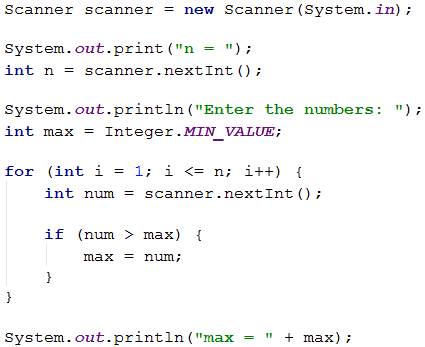

#### Testing in the Judge system

Test your solution here: [https://judge.softuni.bg/Contests/Practice/Index/655#4](https://judge.softuni.bg/Contests/Practice/Index/655#4).

### Example: Min Number

Write a program that inputs **n whole numbers** (**n** > 0) and finds **the Min Number** among them.  The first line of the input, specifies the number of integers **n**. The following **`n`** lines consist of one integer. Exapmles: 

#### Sample input and output

| Input | Output | 
| --- | --- |
| 2 100 99 | 99 |
| 3 -10 20 -30 | -30 |
| 4 45 -20 7 99  | -20 |

#### Hints and Guidelines

The problem is completely identical to the previous one but this time we will start with another neutral starting value **10000000000000** (or **`Integer.MAX_VALUE`**).

#### Testing in the Judge system

Test your solution here: [https://judge.softuni.bg/Contests/Practice/Index/655#5](https://judge.softuni.bg/Contests/Practice/Index/655#5).

### Example: Left and Right Sum

Write a program that inputs **2 \* n whole numbers** and checks if the **sum of the first n numbers** (left sum) is equal to the **sum of the second n numbers** (right sum). If the sums are equal, print **"Yes" + sum**, if not, print **"No" + difference**. The difference is calculated as a positive number (absolute value). The format of the output must be identical to the examples below.

#### Sample input and output

| Input | Output | Input | Output |
| --- | --- | --- | --- | 
| 2 10 90 60 40 | Yes, sum = 100 | 2 90 9 50 50 | No, diff = 1 |

#### Hints and Guidelines

Input the number **n**, after that the first **n** numbers (**left** half) and sum them up. Input the second **n** numbers (**right** half) and find their sum. We calculate the **difference**  between the sums by absolute value: **`Math.abs(leftSum - rightSum)`**. If the difference is **0**, print **"Yes" + sum**, otherwise print **"No" + difference**.

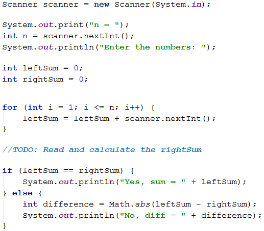

#### Testing in the Judge system

Test your solution here: [https://judge.softuni.bg/Contests/Practice/Index/655#6](https://judge.softuni.bg/Contests/Practice/Index/655#6).

### Example: Odd Even Sum 

Write a program that inputs **n whole numbers** and checks is **the sum of numbers on even positions** is equal to **the sum of numbers on odd positions**. If the sums are equal, print **"Yes" + sum**, otherwise print **"No" + difference**. The difference is calculated as a positive number (absolute value). The format of the output must be identical to the examples below.

#### Sample input and output

| Input | Output |
| --- | --- |
| 4 10 50 60 20 | Yes Sum = 70 |
| 4 3 5 1 -2 | No Diff = 1 |
| 3 5 8 1 | No Diff = 2 |

#### Hints and Guidelines

We input the numbers one by one and calculate the two **sums** (of the numbers on **even** positions and the numbers on **odd** positions). Identically to the previous problem, we calculate the absolute value of the difference and print the result (**"Yes" + sum** if the difference equals 0 or **"No" + difference** in every other case).

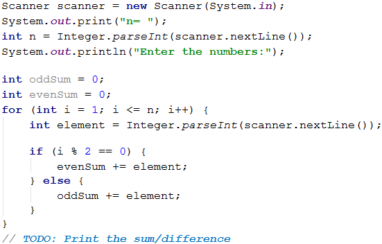

**`+=`** is **combined assigment operator** that is being frequently used, it adds the value of the right to the left operand and then assignes the result to the left operand. 
**C += A** is equivalent to **C = C + A**.

#### Testing in the Judge system

Test your solution here: [https://judge.softuni.bg/Contests/Practice/Index/655#7](https://judge.softuni.bg/Contests/Practice/Index/655#7).

### Exapmle: Vowels Sum 

Write a program that inputs **text** (string), calculates and prints **the sum of the values of vowels** according to the table below:

| a | e | i | o | u | 
| :---: | :---: | :---: | :---: | :---: |
| 1 | 2 | 3 | 4 | 5 |

#### Sample input and output

| Input | Output | Input | Output | 
| --- | --- | --- | --- |
| hello | 6 (e+o = 2+4 = 6) | bamboo | 9 (a+o+o = 1+4+4 = 9) |
| hi | 3 (i = 3) | beer | 4 (e+e = 2+2 = 4) |

#### Hints and Guidelines

We read the input text **`s`**, after that we null the sum and run a loop from **0** to **`s.length() - 1`** (text lenght -1). We check every letter **`s.charAt(i)`** if it's a vowel and add its value to the sum. 

#### Testing in the Judge system

Test your solution here: [https://judge.softuni.bg/Contests/Practice/Index/655#8](https://judge.softuni.bg/Contests/Practice/Index/655#8).

## What have we learned from this chapter?

We can repeat block of code using **`for` loop**:

We can read series of **`n`** number from the console:

## Exercises: Repetitons (Loops)

After we got acquainted with the loops it is time to **solidify what we have learned by practicing it**, by writing a lot of code. Lets solve а some problems for exersise.

### Creating new project in IntelliJ IDEA

We start by creating a new project in IntelliJ IDEA to better organise our solutions for the exersise. For each task we will create a separate class.

Start IntelliJ IDEA and select: **[Create New Project]**.

after that in the left field select Java, if **PROJECT SDK: ** is empty we select the path to the Java **JDK** installation directory and click on the button **[Next]**.

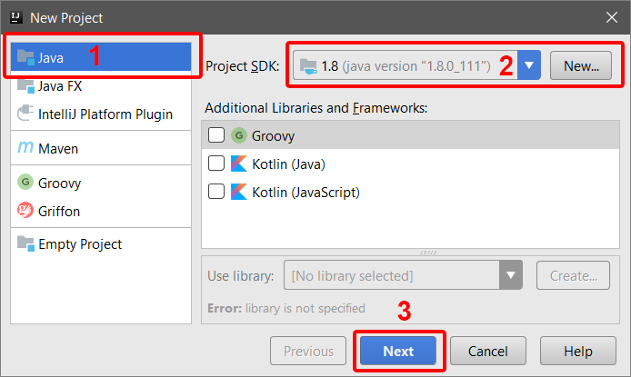

In the next window we again click on the button **[Next]**.

We name the project (Project name:) **Loops** and select the directory where the project will be saved (Project location:).
After that we click on the button **[Finish]**.

 
In the next window we click on the **[OK]** button to create **Project location** if the directory doesn't exist.

We created a new project. If we click on the triangle in front of **Loops** in the left window we will open the structure of project.

За да създадем в нашият проект **пакет**, който да съдържа всички класове с решенията на задачите за упражнение, натискаме десен бутон на мишката върху **src**, избираме **New** -> **Package** и наименуваме пакета **tasks** (с малка първа буква).

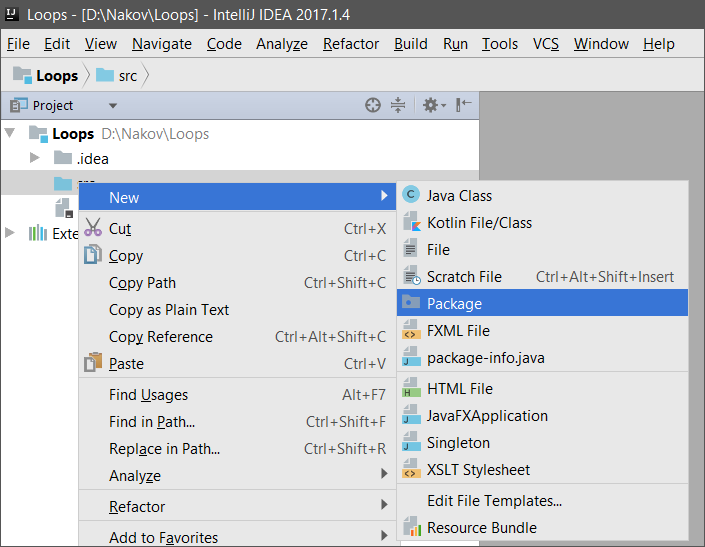

За да създадем нов клас за първото упражнение, натискаме десен бутон на мишката върху **tasks**, избираме **New** -> **Java Class** и наименуваме класа **Task_01** (с главна първа буква).

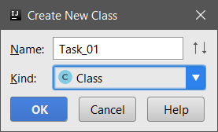

След тези промени структурата на проекта ще изглежда по следния начин:
 

 
 Като за всяко следващо упражнение създадем нов клас, по описания по-горе начин за създаване на клас. 
 
### Задача: Елемент, равен на сумата на останалите

Да се напише програма, която въвежда **n цели числа** и проверява дали сред тях съществува число, което е равно на сумата на всички останали. Ако има такъв елемент, се отпечатва **"Yes" + неговата стойност**, в противен случай - **"No" + разликата между най-големия елемент и сумата на останалите** (по абсолютна стойност). 

#### Примерен вход и изход

| Вход | Изход | Коментар |
| --- | --- | :---: |
| 7 3 4 1 1 2 12 1 | Yes Sum = 12 | 3 + 4 + 1 + 2 + 1 + 1 = 12 |
| 4 6 1 2 3 | Yes Sum = 6 | 1 + 2 + 3 = 6 |
| 3 1 1 10 | No Diff = 8 | &#124;10 - (1 + 1)&#124; = 8 |
| 3 5 5 1 | No Diff = 1 | &#124;5 - (5 + 1)&#124; = 1 |
| 3 1 1 1 | No Diff = 1 | - |

#### Насоки и подсказки

Трябва да изчислим **сумата** на всички елементи, да намерим **най-големия** от тях и да проверим търсеното условие.

#### Тестване в Judge системата

Тествайте решението си тук: [https://judge.softuni.bg/Contests/Practice/Index/655#9](https://judge.softuni.bg/Contests/Practice/Index/655#9).

### Задача: четни / нечетни позиции

Напишете програма, която чете **n числа** и пресмята **сумата**, **минимума** и **максимума** на числата на **четни** и **нечетни** позиции (броим от 1). Когато няма минимален / максимален елемент, отпечатайте **"No"**. 

#### Примерен вход и изход

| Вход | Изход | Вход | Изход |
| --- | --- | --- | --- |
| 6 2 3 5 4 2 1 | OddSum=9, OddMin=2, OddMax=5, EvenSum=8, EvenMin=1, EvenMax=4 | 2 1.5 -2.5 | OddSum=1.5, OddMin=1.5, OddMax=1.5, EvenSum=-2.5, EvenMin=-2.5, EvenMax=-2.5 |
| 1 1 | OddSum=1, OddMin=1, OddMax=1, EvenSum=0, EvenMin=No, EvenMax=No | 0 | OddSum=0, OddMin=No, OddMax=No, EvenSum=0, EvenMin=No, EvenMax=No |
| 5 3 -2 8 11 -3 | OddSum=8, OddMin=-3, OddMax=8, EvenSum=9, EvenMin=-2, EvenMax=11 | 4 1.5 1.75 1.5 1.75 | OddSum=3, OddMin=1.5, OddMax=1.5, EvenSum=3.5, EvenMin=1.75, EvenMax=1.75 |
| 1 -5 | OddSum=-5, OddMin=-5, OddMax=-5, EvenSum=0, EvenMin=No, EvenMax=No | 3 -1 -2 -3 | OddSum=-4, OddMin=-3, OddMax=-1, EvenSum=-2, EvenMin=-2, EvenMax=-2 |

#### Насоки и подсказки

Задачата обединява няколко предходни задачи: намиране на **минимум**, **максимум** и **сума**, както и обработка на елементите от **четни и нечетни позиции**. Припомнете си ги.

В тази задача е по-добре да се работи с **дробни числа** (не цели). Сумата, минимумът и максимумът също са дробни числа. Трябва да използваме **неутрална начална стойност** при намиране на минимум / максимум, например **1000000000.0** и **-1000000000.0**. Ако получим накрая неутралната стойност, печатаме **“No”**.

#### Тестване в Judge системата

Тествайте решението си тук: [https://judge.softuni.bg/Contests/Practice/Index/655#10](https://judge.softuni.bg/Contests/Practice/Index/655#10).

### Задача: еднакви двойки

Дадени са **2 \* n числа**. Първото и второто формират **двойка**, третото и четвъртото също и т.н. Всяка двойка има **стойност** – сумата от съставящите я числа. Напишете програма, която проверява **дали всички двойки имат еднаква стойност**.

В случай, че е еднаква отпечатайте **"Yes, value=…" + стойността**, в противен случай отпечатайте **максималната разлика** между две последователни двойки в следния формат - **"No, maxdiff=…" + максималната разлика**. 

Входът се състои от число **n**, следвано от **2*n цели числа**, всички по едно на ред.

#### Примерен вход и изход

| Вход | Изход | Коментар |
| --- | --- | :---: | 
| 3 1 2 0 3 4 -1| Yes, value=3 | стойности = {3, 3, 3} еднакви стойности | 
| 2 1 2 2 2 | No, maxdiff=1 | стойности = {3, 4} разлики = {1} макс. разлика = 1 |
| 4 1 1 3 1 2 2 0 0 | No, maxdiff=4 | стойности = {2, 4, 4, 0} разлики = {2, 0, 4} макс. разлика = 4 |
| 1 5 5 | Yes, value=10 | стойности = {10} една стойност еднакви стойности |
| 2 -1 0 0 -1 | Yes, value=-1 | стойности = {-1, -1} еднакви стойности | 
| 2 -1 2 0 -1 | No, maxdiff=2 | стойности = {1, -1} разлики = {2} макс. разлика = 2 |

#### Насоки и подсказки

Прочитаме входните числа **по двойки**. За всяка двойка пресмятаме **сумата** ѝ. Докато четем входните двойки, за всяка двойка, без първата, трябва да пресметнем **разликата с предходната**. За целта е необходимо да пазим в отделна променлива сумата на предходната двойка. Накрая намираме **най-голямата разлика** между две двойки. Ако е **0**, печатаме **“Yes”** + стойността, в противен случай - **“No”** + разликата.

#### Тестване в Judge системата

Тествайте решението си тук: [https://judge.softuni.bg/Contests/Practice/Index/655#11](https://judge.softuni.bg/Contests/Practice/Index/655#11).

## Упражнения: графични и уеб приложения

В настоящата глава се запознахме с **циклите** като конструкция в програмирането, която ни позволява да повтаряме многократно дадено действие или група от действия. Сега нека си поиграем с тях. За целта ще начертаем няколко фигурки, които се състоят от голям брой повтарящи се графични елементи, но този път не на конзолата, а в графична среда, използвайки "**графика с костенурка**". Ще е интересно. И никак не е сложно. Опитайте!

### Задача: чертане с костенурка – графично GUI приложение

Целта на следващото упражнение е да си поиграем с една **библиотека за рисуване**, известна като **“графика с костенурка” (turtle graphics)**. Ще изградим графично приложение, в което ще **рисуваме различни фигури**, придвижвайки нашата **“костенурка”** по екрана чрез операции от типа “отиди напред 100 позиции”, “завърти се надясно на 30 градуса”, “отиди напред още 50 позиции”. Приложението ще изглежда приблизително така:

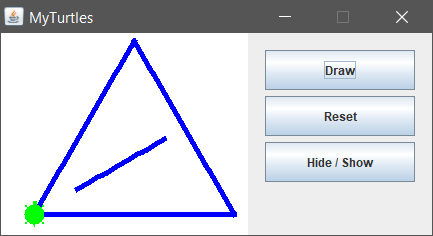

Нека първо се запознаем с **концепцията за рисуване “Turtle Graphics”**. Може да разгледаме следните източници:
  * Дефиниция на понятието “turtle graphics”: [http://c2.com/cgi/wiki?TurtleGraphics](http://c2.com/cgi/wiki?TurtleGraphics)
  * Статия за “turtle graphics” в Wikipedia – [https://en.wikipedia.org/wiki/Turtle_graphics](https://en.wikipedia.org/wiki/Turtle_graphics)
  * Интерактивен онлайн инструмент за чертане с костенурка – [https://blockly-games.appspot.com/turtle](https://blockly-games.appspot.com/turtle)

Започваме, като създаваме нов **Java проект** в **IntelliJ IDEA**. След това, добавяме нов пакет **`app`** (описано е как се прави по-рано в тази глава). Сваляме **`MyTurtle.java`** и **`jturtle-0.1.1.jar`** от [https://github.com/SoftUni/Programming-Basics-Book-Java-BG/tree/master/assets/chapter-5-1-assets](https://github.com/SoftUni/Programming-Basics-Book-Java-BG/tree/master/assets/chapter-5-1-assets). **`MyTurtle.java`** е предварително написан клас, който ще ни помогне по-бързо да се запознаем с библиотеката **`jturtle-0.1.1.jar`**, която управлява **костенурката**. Като използваме файл навигатор, копираме **`MyTurtle.java`** в директорията **`app`** на създадения проект. След това трябва да добавим външната библиотека **`jturtle-0.1.1.jar`** в нашия проект. Това става по следния начин:
  * Избираме от **File** менюто **Project Structure** (CTRL + SHIFT + ALT + S).
  * Натискаме **Select Modules** в левия панел.
  * Натискаме **Dependencies** таба.
  * Натискаме **'+'** → **JARs or directories**.

На следващия прозорец задаваме пътя до **jturtle-0.1.1.jar**, след това натискаме [**ОК**].
 
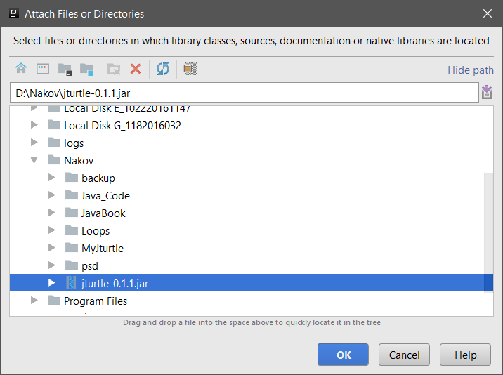

На следващия прозорец маркираме само **classes** кутийката, след това натискаме [**ОК**].
 
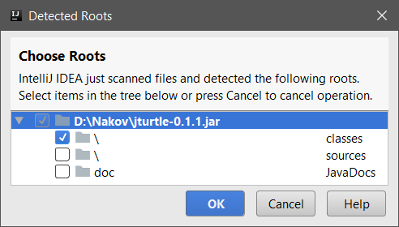

На следващия прозорец избираме [**ОК**] и сме готови да отворим **`MyTurtle.java`**.
  

#### Основни методи на класа `Turtle`

Това е основните действия в класа `Turtle`, с които чертаем:

| Връщана   стойност | Метод и неговото описание |
| ------ | ---------------------------------------- |
| Turtle | **back**(double distance) – мести костенурката назад | 
| Turtle | **bk**(double distance) – работи като **back**(double distance) |
| Turtle | **forward**(double distance) – мести костенурката напред |
| Turtle | **fd**(double distance) – работи като **forward**(double distance) |
| Turtle | **hideTurtle**() – скрива костенурката |
| Turtle | **ht**() – действието е същото като **hideTurtle**() |
| Turtle | **home**() – измества костенурката обратно до началната й позиция, обърната на север |
| Turtle | **left**(double degrees) – завърта костенурката на ляво(в градуси) |
| Turtle | **lt**(double degrees) – действа като **left**(double degrees) |
| Turtle | **penDown**() – закача писалка за костенурката, която оставя линия, когато костенурката се движи |
| Turtle | **pd**() – работи като **penDown**() |
| Turtle | **penUp**() – откача писалката от костенурката |
| Turtle | **penWidth**(int newWidth) – задава широчина на писалката |
| Turtle | **right**(double degrees) – завърта костенурката на дясно (в градуси) |
| Turtle | **rt**(double degrees) – работи като **right**(double degrees) |
| Turtle | **setColor**(Color color) – задава цвят на писалката |
| Turtle | **setLineWidth**(double lineWidth) – задава дебелина на линията |
| Turtle | **setPenColor**(Color color) – задава цвят на писалката за чертане |
| Turtle | **setPos**(double x, double y) – измества костенурката на нова позиция с координати(x, y) |
| Turtle | **showTurtle**() – показва костенурката |
| Turtle | **st**() – работи като **showTurtle**() |
| Turtle | **speed**(double newSpeed) – задава скорост на костенурката |

За да създадем метод който чертае триъгълник, в **`MyTurtle.java`** намираме празния метода **`drawTriangle()`** и написваме следния код: 

Този код мести и върти костенурката, която в началото е в центъра на екрана (в средата на формата), и чертае равностранен триъгълник. Може да го редактирате и да си поиграете с него.

**Стартираме** приложението с [**Shift + F10**]. Тестваме го дали работи (натискаме [**Draw**] бутона няколко пъти):

Сега може да променим и усложним кода на **костенурката**, като добавим следния код към нашия метод **`drawTriangle()`**: 

Отново **стартираме** приложението с [**Shift + F10**]. Тестваме дали работи новата програма за костенурката:

Вече нашата костенурката чертае по-сложни фигури.

Нека напишем кода и за останалите два бутона: целта на бутона [**Reset**] е да изтрие начертаната графика и да позиционира костенурката в нейната начална позиция, допълваме метода **`resetTurtle()`** със следния код:

Целта на бутона [**Hide / Show Turtle**] е да показва или скрива костенурката, допълваме метода **`showTurtle()`** със следния код:: 

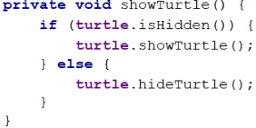

Отново **стартираме** приложението с [**Shift + F10**] и тестваме, дали двата бутона работят коректно.

### Задача: * чертане на шестоъгълник с костенурката

Добавете бутон [**Hexagon**], който чертае правилен шестоъгълник:

**Подсказка:**

В цикъл повторете 6 пъти следното:
* Ротация на 60 градуса.
* Движение напред 100.

### Добавяне на нов бутон за чертане на фигура

За добавяне нов бутон за чертане на нова фигура, може да проследим логиката в **`MyTurtle.java`** за бутона [**Draw**] и да създадем нов бутон за чертане на шестоъгълник **Hexagon**.

Първо добавяме новата фигура в **`enum Shape`**:

Създаваме нов бутон и му добавяме **`ActionListener`**, който присвоява на **`shape`** новата **`enum`** стойност:

След това добавяме новия бутон в **`bList`**:

Създаваме нов метод **`drawHex()`**, чрез който костенурката чертае шестоъгълник.
Задължително в края на метода **`shape = ""`**, този ред предотвратява многократното изпълнение на нашия метод!

В **`Thread t`** добавяме **`case "Hexagon`"**, който да извиква метода **`drawHex()`**:

### Задача: * чертане на звезда с костенурката

Добавете бутон [**Star**], който чертае звезда с 5 върха (**петолъчка**), като на фигурата по-долу:

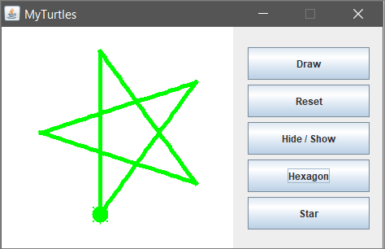

**Подсказка:**

Сменете цвета: **`turtle.setPenColor(Color.green);`**. 

В цикъл повторете 5 пъти следното:
* Движение напред 200.
* Ротация на 144 градуса.

### Задача: * чертане на спирала с костенурката

Добавете бутон [**Spiral**], който чертае спирала с 20 върха като на фигурата по-долу:

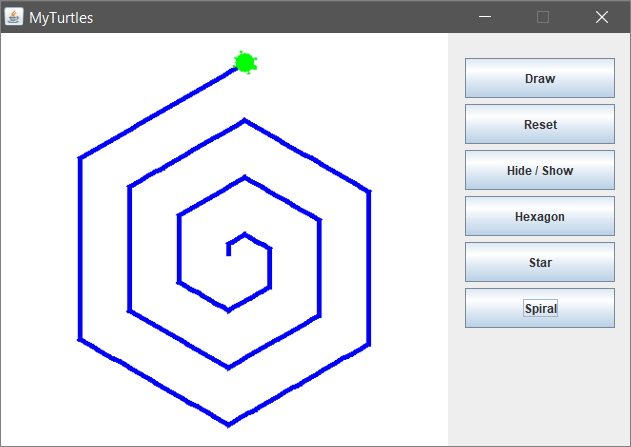

**Подсказка:**

Чертайте в цикъл, като движите напред и завъртате. С всяка стъпка увеличавайте постепенно дължината на движението напред и завъртайте на 60 градуса.

### Задача: * чертане на слънце с костенурката

Добавете бутон [**Sun**], който чертае слънце с 36 върха като на фигурата по-долу:

### Задача: * чертане на спирален триъгълник с костенурката

Добавете бутон [**Triangle**], който чертае три триъгълника с по 22 върха като на фигурата по-долу:

**Подсказка:**

Чертайте в цикъл като движите напред и завъртате. С всяка стъпка увеличавайте с 10 дължината на движението напред и завъртайте на 120 градуса. Повторете 3 пъти за трите триъгълника.

Ако имате проблеми с примерния проект по-горе попитайте във **форума на СофтУни**: https://softuni.bg/forum.
