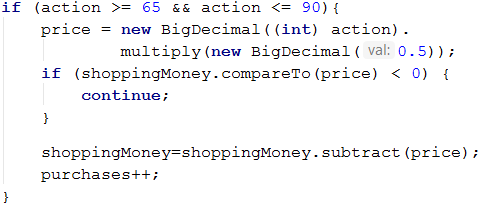
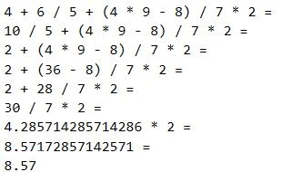
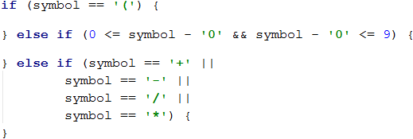
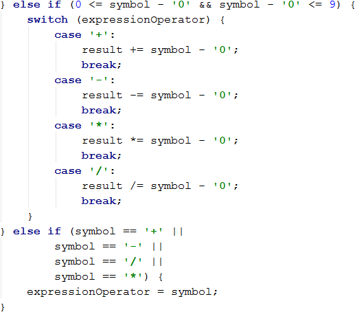

# Chapter 9.2. problem for champions – part II

In this chapter we, will review three additional problems that belong to the category "**for champions**", i.e., they are more complex than the rest of the problems in this book.

## More complex problems on the studied material

Before moving on to particular problems, we must clarify that we can solve them more efficiently with **additional knowledge in programming with Java** (methods, arrays, collections, recursion, etc.). Each solution that we will provide now only uses the material covered in this book. The goal is to learn how to construct **more complex algorithms** based on your knowledge up to the present moment.

## problem: Passion shopping days

Lina has a real shopping passion. When she has some money, she immediately goes to the closest shopping center (mall) and tries to spend as much as she can on clothes, bags, and shoes. But her favorite thing is winter sales. Our problem is to analyze her strange behavior, **calculate the purchases** that Lina does when she enters the mall, as well as the **money she has left** when the shopping is over. All prices and money are in BGN (Bulgarian levs, **lv**).

The **first line** of the input will pass the **amount** that Lina has **before** she starts shopping. Then, upon reading the "**`mall.Enter`**" command, Lina enters the mall and starts shopping we receive the "**`mall.Exit`**" command. When Lina starts shopping, **on each line** of the input, we will receive strings that are **actions performed by Lina**. Each **symbol** in the string is a **purchase or another action**. String commands contain only symbols of the **ASCII table**. The ASCII code of each sign is **related to what Lina must pay** for each of the goods. You need to interpret the symbols in the following way:

- If the symbol is a **capital letter**, Lina gets a **50% discount**, which means that you must decrease the money she has by 50% of the numeric representation of the symbol from the ASCII table.
- If the symbol is a **lowercase letter**, Lina gets a **70% discount**, which means that you must decrease the money she has by 30% of the numeric representation of the symbol from the ASCII table.
- If the symbol is **"`%`"**, Lina makes a **purchase** that decreases her money in half.
- If the symbol is **"`*`"**, Lina **withdraws money from her debit card** and adds 10 lv. to her available funds.
- If the symbol is **different from all above**, Lina just purchases without discount, and in this case, you should subtract the value of the symbol from the ASCII table from her available funds.

If any of the purchase's values is **greater than** her current available funds, Lina **DOES NOT** make the purchase. Lina's funds **cannot be less than 0**.

The shopping ends when the "**`mall.Exit`**" command is given. When this happens, you need to **print the number of purchases made and the money** that Lina has left.

### Input data

We will read input data from the console. The **first line** of the input will indicate the **amount that Lina has before starting to purchase**. On each of the following lines, there will be a particular command. After we receive the "**`mall. Enter`**" command, then on each of the following lines, we will receive commands (strings) that contain **information about the purchases/actions** that Lina wants to perform. We will receive strings until the "**`mall.Exit`**" command is given.

We will receive only one "**`mall.Enter`**" command and only one "**`mall.Exit`**" command.

### Output data

The output data must be **printed on the console**.
When shopping is over, you must print on the console a particular output depending on what purchases have been made.
- If **no purchases have been made** – "**No purchases. Money left: {remaining funds} lv.**"
- If **at least one purchase** is made – "**{number of purchases} purchases. Money left: {remaining funds} lv.**"

**The funds** must be printed with an **accuracy of up to 2 symbols after the decimal point**.

### Constraints

- Money is a **float** number within the range: [**0 - 7.9 x 1028**].
- The number of strings between "**`mall.Enter`**" and "**`mall.Exit`**" will be within the range: [**1-20**].
- The number of symbols in each string that represents a command will be within the range: [**1-20**].
- Allowed execution time: **0.1 seconds**.
- Allowed memory: **16 MB**.

### Sample input and output

| Input | Output | Comment |
|------|-------|----------|
| 110 mall.Enter d mall.Exit | 1 purchases. Money left: 80.00 lv. | ‘d’ has an ASCII code of 100. ‘d’ is a small letter, this is why Lina gets a 70% discount. She spends 30% of 100, which is 30 lv. After this purchase, she has: 110 - 30 = 80 lv. |

| Input | Output |Input | Output |
|------|-------|------|-------|
| 110 mall.Enter % mall.Exit|1 purchases. Money left: 55.00 lv.| 100 mall.Enter Ab \*\* mall.Exit|2 purchases. Money left: 58.10 lv.|

### Hints and guidelines

We will separate the solution of the problem into three main parts:
- Processing of the **input**.
- **Algorithm** for solving the problem. 
- Formatting the **output**.

Let's examine each of the parts in detail.

#### Processing the input data

The input of our problem consists of a few components:
- On the **first line, we have all the money** that Lina has for shopping.
- On **each of the following lines**, we will have kind of **command**.

The first part of the reading is trivial. We should keep in mind that we will be using the **`BigDecimal`** type because we are working with money, and we need precise accuracy:

The second one contains a detail that we need to take into consideration. The requirements state the following:

> After we receive the "**`mall. Enter`**" command, then on each of the following lines, we will receive commands (strings) that contain information about the purchases/actions that Lina wants to perform.

It is where we need to take into consideration the fact that from the **second input line on, we need to start reading commands**, but **only after we read** the command **"mall.Enter"**, we must begin processing them. How can we do this? Using a **`while`** or a **`do-while`** loop is a good option. Here is an exemplary solution of how **to skip** all commands before processing the command "**`mall.Enter`**":

Here is the place to point out that calling **`scanner.nextLine()`** after the end of the loop is used for **moving to the first command** for processing.

#### Algorithm for solving the problem

The algorithm for solving the problem is a direct one – we continue **reading commands** from the console **until the command "mall.Exit" is passed**. In the meantime, we **process** each symbol (**`char`**) of each one of the commands according to the rules specified in the problem requirements, and in parallel, we **modify the amount** that Lina has and **store the number of purchases**.

Let's examine the first two sub-problems for our algorithm. The first sub-problem concerns the way we read the commands until we reach the **"mall.Exit"** command. The solution that we previously saw uses a **`while-loop`**. The second sub-problem is to **access each symbol** of the command passed. Keeping in mind that the input data with the commands is a **`String`** type, the easiest way to access each symbol inside the strings is via a **`foreach` loop**. 

Here is how the code will look like when are using those two types of loops:

The next part of the algorithm, is to **process the symbols from the commands**, according to the following rules in the requirements:

> * If the symbol is a **capital letter**, Lina gets a 50% discount, which means that you must decrease the money she has by 50% of the numeric representation of the symbol from the ASCII table.
> * If the symbol is a **lowercase letter**, Lina gets a 70% discount, which means that you must decrease the money she has by 30% of the numeric representation of the symbol from the ASCII table.
> * If the symbol is **"%"**, Lina purchases that decrease her money in half.
> * If the symbol is **"\*"**, Lina withdraws money from her debit card and adds 10 lv. to her available funds.
> * If the symbol is **different from all above**, Lina just purchases without discount, and in this case, you should subtract the value of the symbol from the ASCII table from her available funds.

Let's examine the problems that we will be facing in the first condition. The first one is how to distinguish if a particular **symbol is a capital letter**. We can use one of the following ways:
* Keeping in mind that the letters in the alphabet have a particular order, we can use the following condition **`action >= 'A' && action <= 'Z'`** to check if our symbol is within the capital letters range.
* We can use the **`char.IsUpper(..)`** function.

The other problem is how **to skip a particular symbol** if it is not an operation that requires more money than Lina has. It is doable using the **`continue`** construction.

An example for the first part of the requirements looks like this:

**Note**: the variable “**`purchases`**” is of **`int`** type, in which we store the number of all purchases.

We believe the reader should not have difficulties implementing all the other conditions because they are very similar to the first one.

#### Formatting the output

At the end of our problem we must **print** a particular **output**, depending on the following condition:

> - If no purchases have been made – "**No purchases. Money left: {remaining funds} lv.**"
> - If at least one purchase is made – "**{number of purchases} purchases. Money left: {remaining funds} lv.**"

The printing operations are trivial. The only thing we need to keep in mind is that **the amount has to be printed with an accuracy of up to 2 symbols after the decimal point**.

How can we do that? We will leave the answer to this question to the reader.

### Testing in the Judge system

Test your solution here: [https://judge.softuni.org/Contests/Practice/Index/664#0](https://judge.softuni.org/Contests/Practice/Index/664#0).

## problem: Numerical expression

Bonny is an extremely powerful witch. Because her natural power is not sufficient to successfully fight vampires and werewolves, she has started to master the power of Expressions. An expression is hard to master because the spell relies on the ability to **quickly solve mathematical expressions**.

To use an "Expression spell" the witch must know the result of a mathematical expression in advance. An **Expression spell** consists of a few simple mathematical expressions. Each mathematical expression can contain operators for **addition**, **subtraction**, **multiplication**, and/or **division**.

The expression is solved without considering the mathematical rules for calculating numerical expressions. This means that the priority is applied according to the sequence of the operators, and not the type of calculation that they do. The expression **can contain brackets**, as **everything inside the brackets is calculated first**. Every expression can contain multiple brackets but no nested brackets:
- An expression containing **(…(…)…) is an invalid one**.
- An expression containing **(…)…(…) is a valid one**.

### Example

The expression

is solved in the following way:

Bonny is pretty but not as wise, so she will need our help to master the power of Expressions.

### Input data

The input data consists of a single text line passed from the console. It contains a **mathematical expression for calculation**. The line **always ends with the "=" symbol**. The **"="** symbol means the **end of the mathematical expression**.

The input data is always valid and always in the described format. There is no need to validate it.

### Output data

The output data must be printed on the console. The output consists of one line: the **result** of the calculated mathematical expression rounded up to the **second digit after the decimal point**.

### Constraints

- The expressions will consist of a maximum of **2500 symbols**.
- The numbers of each mathematical expression will be within the range [**1 … 9**].
- The operators in the mathematical expressions will always be among **`+`** (addition), **`-`** (subtraction), **`/`** (division) or **`*`** (multiplication).
- The result of the mathematical expression will be within the range [**-100000.00 … 100000.00**].
- Allowed execution time: **0.1 seconds**.
- Allowed memory: **16 MB**.

### Sample input and output

|Input|Output|Input|Output|
|---------------------|----|-----------------------------------|--------|
| 4+6/5+(4\*9–8)/7\*2=|8.57|3+(6/5)+(2\*3/7)\*7/2\*(9/4+4\*1)= | 110.63|

### Hints and guidelines

As usual, we will first read and process the input, then we will solve the problem, and finally, we will print the result, formatted as required.

#### Reading the input data

The input data will consist of only one text line read from the console. Here we have **two ways** to process the input. The first way is by **reading the entire line using the `bufferReader.readLine()`** ( where **`bufferReader`** is a variable from type **`BufferedReader`**) and accessing each symbol (**`char`**) of the line via a **`foreach` loop**. The second one is by **reading the input symbol by symbol using the `bufferReader.read()` command** and processing each symbol.

We will use the second option to solve the problem.

#### Algorithm for solving the problem

For the problems of our problem, we will need two variables:
* One variable that will hold the **current result**.
* Another variable to hold our **current operator**. 

About the code above we must clarify one detail. The default value of the operator is **`+`** so that the first detected number is added to our result.

After we have declared our starting variables we must think of **what our structure** will look like of our program. From the condition of our problem, we know that **every expression is ending with `=`**. It means we have to read and process symbols until we match with **`=`**. After that, we will type a **`while` loop** as shown below.

The next step is the processing of our **`symbol`** variable. We have 3 possible cases for it:
* If the symbol is a **start of a sub-expression placed in brackets**, i.e., the found symbol is a **`(`**.
* If the symbol is a **digit between 0 and 9**. But how can we check this? How can we check if our symbol is a digit? We can use for assistance the **ASCII code** of the symbol, via which we can use the following formula: **`[ASCII code of our symbol] – [ASCII code of the symbol 0] = [the digit that represents the symbol]`**. If **the result of this condition is between 0 and 9**, then our symbol is a **number**. (* We can also use directly `'0'` and `'9'` symbols or their **ASCII codes***.)
* If the symbol is an **operator**, i.e., it is **`+`**, **`-`**, **`*`** or **`/`**.

Let's examine the actions that we need to undertake in the relevant cases that we defined:
* If our symbol is an **operator**, then the only thing we need to do is to **set a new value for the `expressionOperator` variable**.
* If our symbol is a **digit**, then we need to **change the current result of the expression depending on the current operator**, i.e., if **`expressionOperator`** is a **`-`**, then we must **decrease the result by the numerical representation of the current symbol**. We can get the numerical representation of the current symbol via the formula that we used upon checking the condition for this case (the **`[ASCII code of our symbol] – [the ASCII code of the symbol `0`] = [the digit that represents the symbol]`**)

* If our symbol is a **`(`**, this indicates the **beginning of a sub-expression** (an expression in brackets). By definition, **the sub-expression must be calculated before modifying the result of the whole expression** (the actions in brackets are performed first). It means that we will have a local result for the sub-expression and a local operator.

After that, to **calculate the sub-expression value**, we will use the same methods that we used for calculating the main expression – we use a **`while` loop** to **read symbols** (until we reach an **`)`** symbol). Depending on whether the read symbol is a number or an operator, we modify the result of the sub-expression. The implementation of these operations is identical to the above-described logic for calculating expressions. It is why we believe the reader should not have a problem with it.

After completing the calculation of the result of our sub-expression, we **modify the result of the whole expression** depending on the value of the **`expressionOperator`**.

#### Formatting the output

The only output that the program must print on the console is the **result of solving the expression with an accuracy of up to two digits after the decimal point**. How can we format the output this way? We will leave the answer to this question to the reader.

### Testing in the Judge system

Test your solution here: [https://judge.softuni.org/Contests/Practice/Index/664#1](https://judge.softuni.org/Contests/Practice/Index/664#1).

## problem: Bulls and Cows

We all know the game called "Bulls and Cows" ([https://en.wikipedia.org/wiki/Bulls_and_cows](https://en.wikipedia.org/wiki/Bulls_and_cows)). Upon having a particular 4-digit **secret number** and a 4-digit **suggested number**, the following rules are applied:
* If a digit in the suggested number matches a digit in the secret number and is located at the **same position**, we have a ***bull***.
* If a digit in the suggested number matches a digit in the secret number but is located at a **different position**, we have a ***cow***.

| Secret number | 1 | 4 | 8 | 1 |Comment|
|:-------------------:|:---:|:---:|:---:|:---:|:----------:|
| Suggested number| 8 | 8 | 1 | 1 | Bulls = 1 Cows = 2  |

| Secret number          | 2 | 2 | 4 | 1 |Comment|
|:-------------------:|:---:|:---:|:---:|:---:|:----------:|
| Suggested number | 9 | 9 | 2 | 4 | Bulls = 0 Cows = 2 |

Upon having a particular secret number and number of bulls and cows, our problem is **to find all possible suggested numbers*** in ascending order.

If there are **no suggested numbers** that match the criteria provided from the console, we must print "**No**".

### Input data

Our input data consists of 3 arguments: 
 * The first contains **the secret number**.
 * The second contains **the number of bulls**.
 * The third contains **the number of cows**.

The input data will always be valid. There is no need to verify them.

### Output data

The output data must be printed on the console.
The output must consist of **a single line** holding **all suggested numbers**, space-separated.
If there are **no suggested numbers** that match the criteria provided from the console, we must **print “No”**.

### Constraints

- The secret number will always consist of **4 digits in the range** [**1..9**].
- The number of **cows and bulls** will always be in the range [**0..9**].
- Allowed execution time: **0.15 seconds**.
- Allowed memory: **16 MB**.

### Sample input and output

| Input        | Output     |
|--------------|------------|
| 2228 2 1 | 1222 2122 2212 2232 2242 2252 2262 2272 2281 2283 2284 2285 2286 2287 2289 2292 2322 2422 2522 2622 2722 2821 2823 2824 2825 2826 2827 2829 2922 3222 4222 5222 6222 7222 8221 8223 8224 8225 8226 8227 8229 9222 |

| Input        | Output     |
|--------------|------------|
| 1234 3 0 | 1134 1214 1224 1231 1232 1233 1235 1236 1237 1238 1239 1244 1254 1264 1274 1284 1294 1334 1434 1534 1634 1734 1834 1934 2234 3234 4234 5234 6234 7234 8234 9234 |

| Input        | Output     |
|--------------|------------|
| 1234 3 1 | No       |

### Hints and guidelines

We will solve the problem in a few steps:
- We will read the **input data**.
- We will generate all possible **four-digit combinations** (candidates for verification).
- For each generated combination we will calculate **how many bulls** and **how many cows** it has according to the secret number. Upon matching the needed bulls and cows, we will **print the combination**.

#### Reading the input data

We have 3 lines as input data:
 * **Secret number**.
 * **A Number for** desired **bulls**.
 * **A Number for** desired **cows**.

Reading the input data is trivial:

#### Algorithm for solving the problem

Before starting to write the algorithm for solving our problem, we must **declare a flag** that indicates whether a solution has been found:

If, after finishing our algorithm, this flag is still **`false`**, then we will print **`No`** on the console, as specified in the requirements.

Let's start analyzing our problem. What we need to do is **analyze all numbers from `1111` to `9999`**, excluding those containing zeroes (for example **`9011`**, **`3401`**, etc. are invalid). What is the easiest way to **generate** all these **numbers**? We will **use nested loops**. As we have a **4-digit number**, we will have **4 nested loops**, as each of them will generate **an individual digit in our number** for testing.

Thanks to these loops, **we have access to every digit** of all numbers that we need to check. Our next step is to **separate the secret number into digits**. It can be achieved very easily using **a combination of integer division and modular division**.

Only two last steps remain before we begin to analyze how many cows and bulls there are in a particular number. Accordingly, the first step is the **declaration of `counter` variables** in the nested loops, to **count, the cows and bulls** for the current number. The second step is to make **copies of the digits of the current number** that we will analyze, to prevent problems upon working with nested loops, in case we make changes to them.

We are ready to start analyzing the generated numbers. What logic can we use? The easiest way to check how many cows and bulls there are inside a number is via a **sequence of `if-else` conditions**. Yes, it is not the best way, but to use knowledge beyond the scope of this book, we will use this approach.

What conditions do we need?

The condition for the bulls is simple – we check whether the **first digit** of the generated number matches the **same digit** in the secret number. We remove the digits that are already checked to avoid repetitions of bulls and cows.

We repeat the action for the second, third, and fourth digits. 

We will apply the following condition for the cows – first, we will check whether the **first digit** of the generated number **matches the second one**, the **third one**, or the **fourth digit** of the secret number. An example for the implementation:

Then, we check: whether the **second digit** of the generated number **matches the first one**, the **third one**, or the **fourth digit** of the secret number; whether the **third digit** of the generated number matches the **first one**, the **second one**, or the **fourth digit** of the secret number; and finally, we check whether the **fourth digit** of the generated number matches the **first one**, the **second one** or the **third digit** of the secret number.

#### Printing the output

After completing all conditions, we need to **check whether the bulls and cows in the currently generated number match the desired bulls and cows read from the console**. If this is true, we print the current number on the console.

### Testing in the Judge system

Test your solution here: [https://judge.softuni.org/Contests/Practice/Index/664#2](https://judge.softuni.org/Contests/Practice/Index/664#2).
